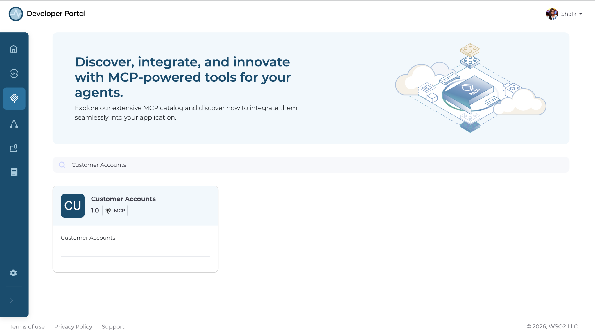
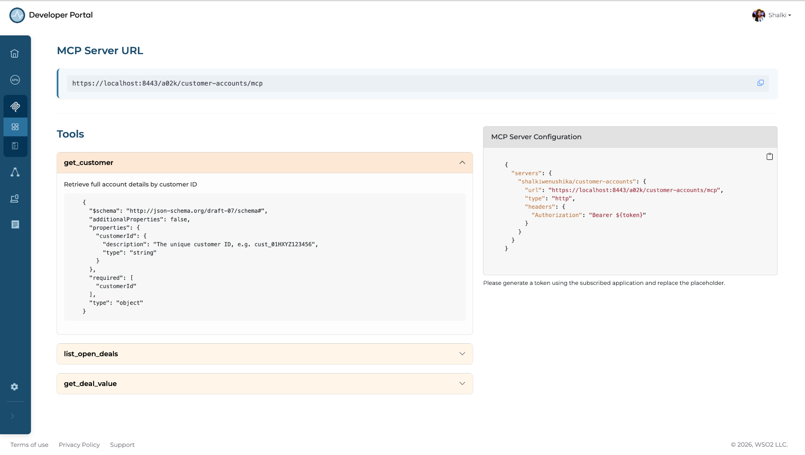
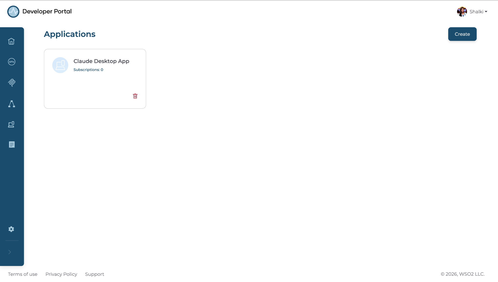
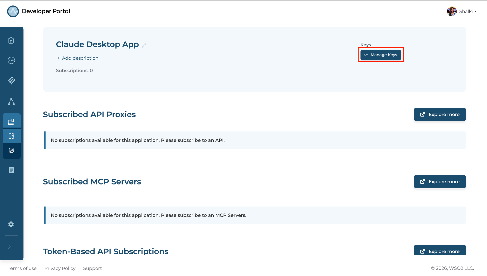
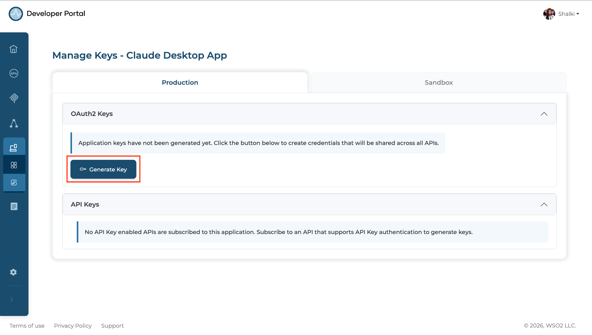
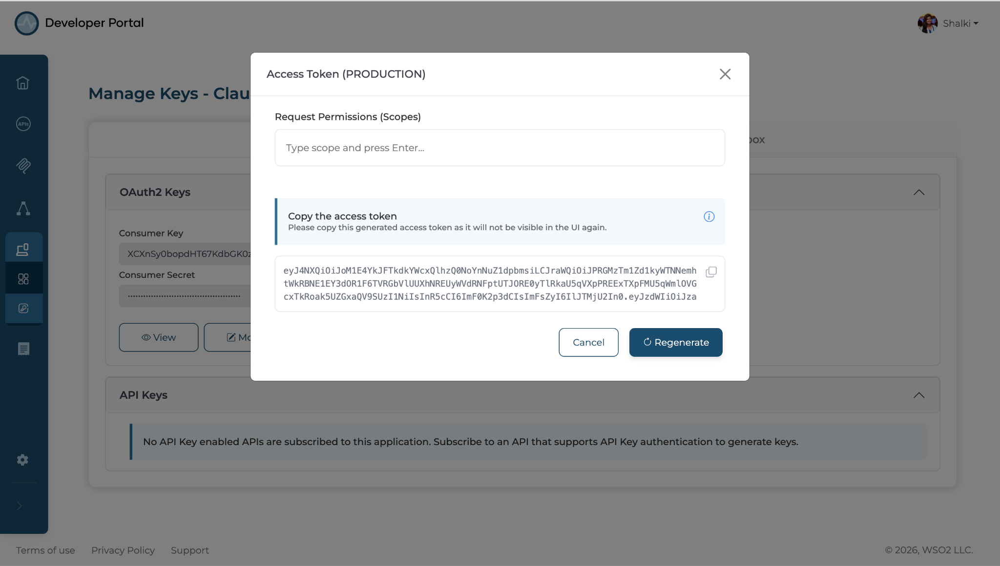
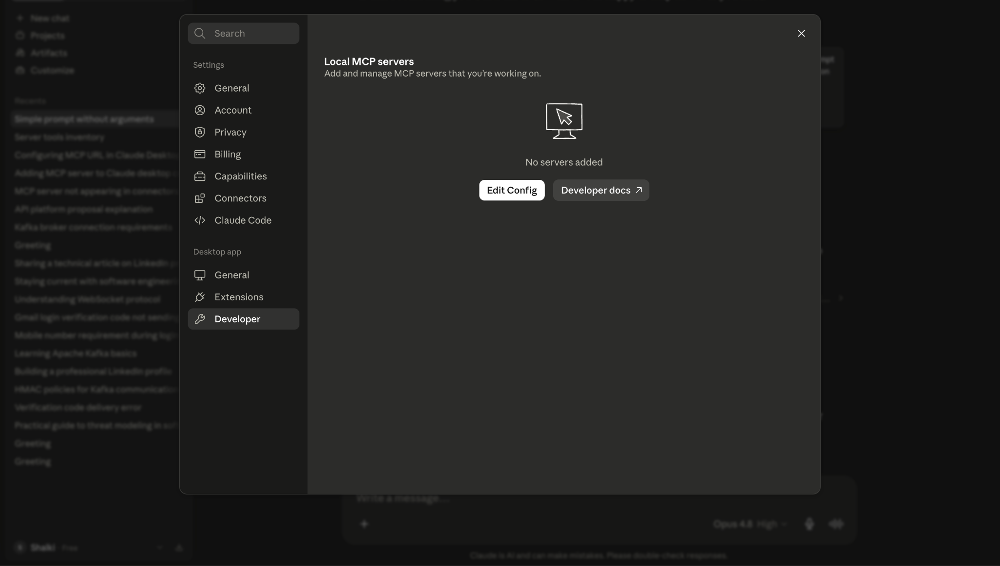
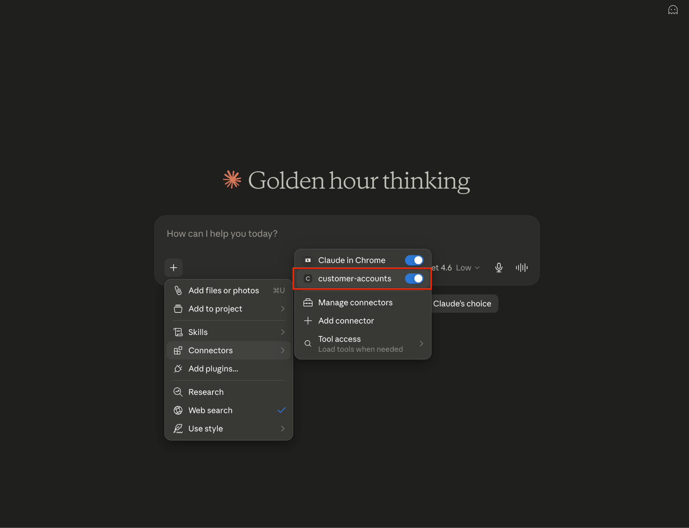
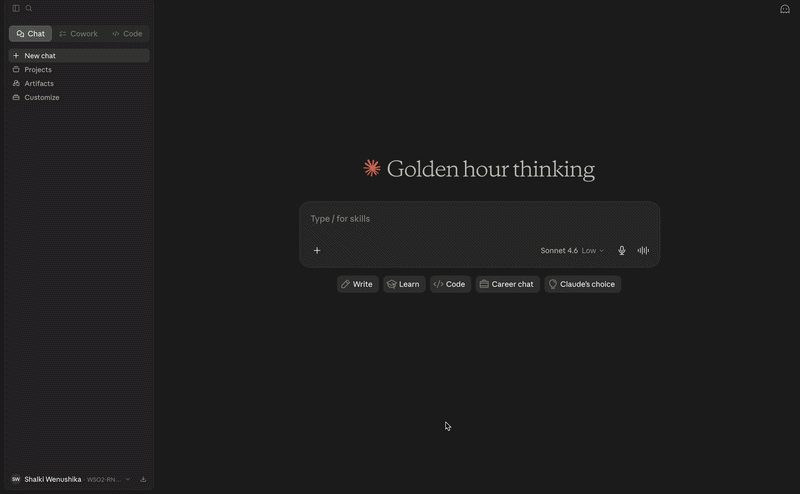

# Find and connect to an enterprise MCP server from the MCP Hub

## Overview

This guide shows you how to discover MCP servers in the MCP Hub, evaluate the tools they expose, generate OAuth2 credentials, and connect Claude Desktop to an enterprise MCP server using a secure MCP Server URL.

In this guide, you will walk through a scenario where an AI engineer is building a sales copilot that needs access to customer, deal, and pricing data through MCP tools. However, they do not know which MCP servers are available, which tools they expose, whether those tools meet the requirements, or how to connect an AI client such as Claude Desktop to them.

---

## Learning objectives

- Discover MCP servers and their available tools in the MCP Hub catalog by searching by name.
- Review tool descriptions and input schemas to verify that they meet your requirements.
- Configure Claude Desktop to connect to an MCP server using an auto-generated MCP Server URL.
- Invoke tools from Claude Desktop through OAuth2-authenticated requests to the MCP server.

---

## Prerequisites

- A WSO2 API Platform account with access to the MCP Hub.
- Claude Desktop installed. Download from [claude.ai/download](https://claude.ai/download).

---

## Architecture

```
[AI Engineer]
    |  browses MCP catalog (by server name)
    v
+--------------------------------------+
|  WSO2 MCP Hub                        |
|  catalog · tool schemas              |
|  MCP Server URLs                     |
|  OAuth2 app creation + token gen     |
+--------------------------------------+
    |  MCP Server URL + OAuth2 token
    v
[Claude Desktop]
    |  tool call + OAuth2
    v
+-----------------------------+
|  WSO2 AI Gateway            |
|  OAuth2 · rate limiting     |
|  audit logging              |
+-----------------------------+
    |  authenticated request
    v
[CRM API backend]
```

AI engineers can discover MCP servers and their tools and obtain the MCP Server URL through the MCP Hub. They can generate an OAuth2 token by creating an application and configure the token in Claude Desktop. The AI Gateway then enforces authentication on every tool call made by Claude Desktop thereafter.

---

## Step 1: Navigate to the MCP Hub and search by name

The MCP Hub catalog is searchable by server name. The fastest way to find relevant tools is to use the search bar and look up the MCP server directly.

Navigate to the MCP Hub and use the search field to find the required MCP server by name.

**Expected result:** The matching MCP servers appear in the results, along with their available tools, such as **Customer Accounts**.

{.cInlineImage-full}


---

## Step 2: Navigate to the Customer Accounts MCP

Before connecting to this MCP server, confirm that the tools it provides cover the questions your sales copilot needs to answer.

Click **Customer Accounts MCP** to open it. Then review the **Tools** section and inspect the input schema for each tool.

**Expected result:** The **Tools** section lists three tools, each with a description and an input schema.

| Tool | Description |
|------|-------------|
| `get_customer` | Retrieve full account details by customer ID |
| `list_open_deals` | List all open deals for a customer account |
| `get_deal_value` | Return the current value of a deal by deal ID |

{.cInlineImage-full}

The schemas confirm what Claude needs to provide to invoke each tool.

---

## Step 3: Create an application

Navigate to the **Applications** tab in the left-side menu. Click **Create**, and provide a name such as `Claude Desktop App`.

**Expected result:** The application is created and listed under the **Applications** tab.

{.cInlineImage-full}

---

## Step 4: Create application credentials

1. Click the newly created application to open it. Go to **Manage Keys**.

   {.cInlineImage-full}

2. Click **Generate Key** to generate the consumer key and consumer secret.

   {.cInlineImage-full}

**Expected result:** The consumer key and consumer secret are generated and displayed in the UI.

---

## Step 5: Create an access token

Click **Generate** to obtain an access token. Copy the access token and save it securely. You'll need it in Step 6.

**Expected result:** The access token is generated and displayed.

{.cInlineImage-full}

---

## Step 6: Configure Claude Desktop to connect to the MCP server

1. Navigate to the **Overview** page of the Customer Accounts MCP and copy the **MCP Server URL**.

2. Open Claude Desktop, then go to **Settings → Developer** and click **Edit Config**. Open the configuration file in VS Code or any text editor.
   
   {.cInlineImage-full}

3. Add the following MCP server configuration, including the MCP Server URL and the access token obtained in Step 5, then save the file.

    ```json
   {
      "mcpServers": {
        "customer-accounts": {
          "command": "npx",
          "args": [
            "mcp-remote",
            "<MCP_SERVER_URL>",
            "--header",
            "Authorization: Bearer <ACCESS_TOKEN>"
          ]
        }
      }
   }
    ```

4. Restart Claude Desktop for the changes to take effect.

5. After restarting, click the **+** icon in the chat box, go to **Connectors**, and verify that the `customer-accounts` MCP server is enabled.
   
   {.cInlineImage-full}

You can now ask Claude to use the tools exposed by this MCP server to answer your questions.

**Expected result:** Claude provides answers to customer detail questions.

{.cInlineImage-full}

---

## Verify

1. In the Claude Desktop tools panel, confirm `customer-accounts` MCP server appears with three tools listed.
2. Start a new conversation and ask: *"What are the open deals for customer account A-4821?"* Confirm Claude invokes `list_open_deals` and returns a response grounded in live CRM data.
3. In AI Workspace, navigate to **Insights → MCP Traffic**. Confirm that the tool invocations are displayed, including the number of tool invocations and the number of unique users.

---

## Troubleshooting

| Issue | Resolution |
|-------|------------|
| `customer-accounts` does not appear as a connector in Claude Desktop after restart | Confirm that the configuration is added within the `mcpServers` object in `claude_desktop_config.json`. Check for any JSON syntax errors and verify that the access token has not expired. |
| HTTP 401 Unauthorized on tool call | Your access token has expired. Generate a new access token from the MCP Hub and update the `claude_desktop_config.json` file. |
| Tool invocations not appearing in AI Workspace insights | Allow up to two minutes for analytics to propagate after the first tool call. |

---

## What you learned

- Discovered MCP servers in the MCP Hub catalog and reviewed their tool schemas to confirm they meet your requirements.
- Generated OAuth2 credentials by creating an application in the MCP Hub.
- Configured Claude Desktop to connect to an enterprise MCP server using an MCP Server URL and an access token.
- Invoked live MCP tools from Claude Desktop through OAuth2-authenticated requests enforced by the AI Gateway.

---

## Next steps

- **Configure MCP ACL policies** - define which MCP servers and tools are exposed through the AI Gateway for different clients and environments.
- **Enable MCP authentication** - enforce identity validation for all MCP tool invocations to ensure only trusted clients can access tools.
- **Apply MCP authorization policies** - control fine-grained access to specific MCP tools and operations based on roles and permissions.
