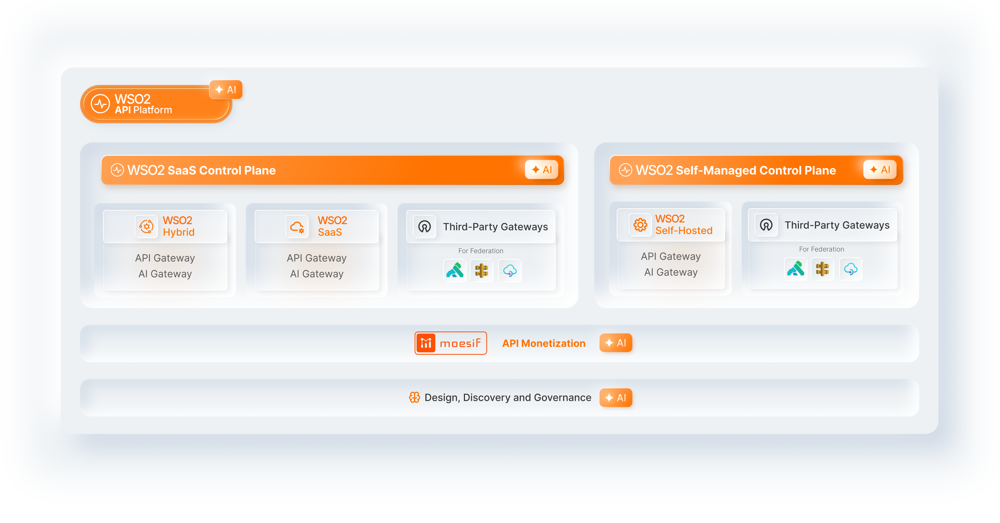
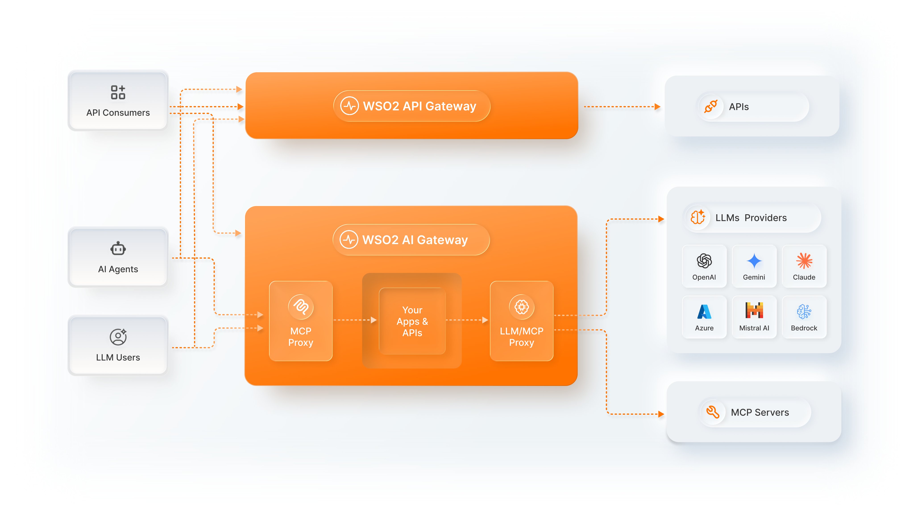
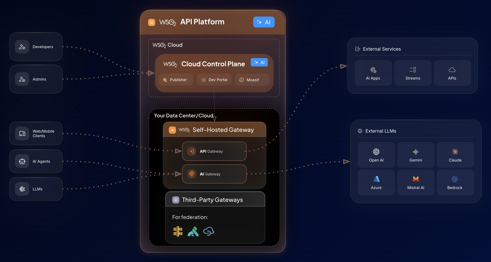
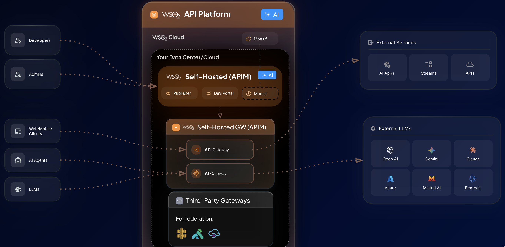
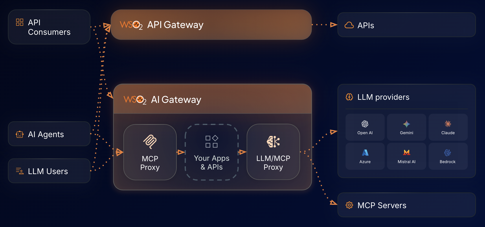

# Overview

## What is the WSO2 API Platform?
The WSO2 API Platform helps you manage, secure, and govern your APIs and AI services. Whether you need to proxy REST APIs, route traffic to LLM providers such as OpenAI or Anthropic, or expose your services as MCP tools for AI agents, the platform provides the tools and controls to do so.

This page explains what the platform offers and helps you determine which path is right for you.

## What are you looking for?

There are two starting points depending on what you need:

1. [**I want a full, end-to-end platform for managing my APIs and AI services**](#i-want-a-full-end-to-end-platform-for-managing-my-apis-and-ai-services) or,
2. [**I only want an API or AI gateway (and have no need for a UI or full platform capabilities)**](#i-only-want-an-api-or-ai-gateway-and-have-no-need-for-a-ui-or-full-platform-capabilities)

With WSO2’s API Platform, both of these needs can be easily served. Here is a deeper look at how users can get started with either scenario:

### I want a full, end-to-end platform for managing my APIs and AI services

If you are looking for a web console where you can create APIs, configure AI gateways, set up developer portals, manage subscriptions, apply policies, and monitor traffic, you want the managed platform. The platform handles the full API lifecycle: design, deploy, test, govern, and monetize.

The next question is: **who runs the infrastructure?**

* **Option A: Cloud (WSO2 hosts everything)**
    
    

    The fastest way to get started. WSO2 runs the control plane (where you design and manage APIs) and the data plane (the gateways, where traffic flows). Sign up and start creating APIs within minutes. There is no infrastructure to manage.

    * **Best for:** Startups, mid-market companies, AI POCs, and teams that want to ship fast without managing infrastructure.

    * **What is included:** API Control Plane, AI Workspace, Developer Portal, Moesif Analytics, API Gateway, and AI Gateway, all managed by WSO2.

    * [Cloud documentation](cloud/introduction/what-is-bijira.md)

* **Option B: Hybrid (WSO2 hosts the control plane, you host the gateways)**
    
    

    You get the convenience of a cloud managed control plane (the UI where you design and govern APIs), but the gateways run in your own data center or cloud account. API traffic never leaves the infrastructure that you manage. This satisfies the majority of data residency requirements globally.

    * **Best for:** Mid-market and enterprise customers who need governance with data privacy. Organizations that want managed convenience but cannot allow traffic to flow through third-party infrastructure.

    * **What is included:** Cloud control plane (AI Workspace, Developer Portal, Moesif) managed by WSO2, plus self-hosted gateways (API Gateway, AI Gateway) in your environment. You can also federate third-party gateways (AWS, Azure, Kong, Envoy) under the same control plane.

    * [Set up hybrid deployment](cloud/api-platform-gateway/getting-started.md)

* **Option C: Self-managed (API Manager)**
    
    

    You download and run the entire stack on your own infrastructure, including the control plane, gateways, portal, and everything else. You have full control over where your software and data resides. The platform is built on an open source foundation for maximum customization.
    
    This is the API Manager product. It bundles specific platform components into a versioned release (for example, API Manager 4.7 includes API Gateway 1.6 and Control Plane 1.9). Starting with version 4.7, API Manager uses the same Go-based gateway runtime as the Cloud and Hybrid offerings.
    
    * **Best for:** Enterprises with strict data residency requirements, government agencies, regulated industries, air-gapped environments, and organizations that require complete control of the infrastructure.
    
    * **What is included:** Self-hosted control plane (Publisher, Developer Portal), self-hosted gateways (API Gateway, AI Gateway). Moesif analytics can be connected separately. Third-party gateways can be federated.
    
    * [API Manager documentation](api-manager/overview.md)

#### How do the three options compare?

| Feature | Cloud | Hybrid | Self-Managed (API Manager) |
| :--- | :--- | :--- | :--- |
| **Control plane** | WSO2 managed | WSO2 managed | Customer managed |
| **Gateways** | WSO2 managed | Customer managed | Customer managed |
| **API traffic stays in your infrastructure** | No | Yes | Yes |
| **Setup complexity** | Minimal | Moderate | High |
| **Web UI for managing APIs** | Yes | Yes | Yes |
| **Developer portal** | Included | Included | Included |
| **AI Workspace** | Included | Included | Separate purchase |
| **Third-party gateway federation** | Yes | Yes | Yes |
| **Air-gapped or fully offline** | No | No | Yes |

> All three options use the same underlying gateway technology. You can start with Cloud and move to Hybrid or Self-Managed later without rearchitecting.

### I only want an API or AI gateway (and have no need for a UI or full platform capabilities)
If you do not need a full management console and want a high-performance gateway that you configure using YAML files, CLI, or REST APIs, the standalone gateways are the right choice. There is no web UI, no control plane, and no portal. You download a lightweight binary and run it.

There are two standalone gateways:

* **API Gateway**
    For traditional API traffic including REST, WebSocket, and GraphQL. Apply authentication, rate limiting, request and response transformations, and custom policies. Everything is configured through YAML files and CLI commands.
    * [API Gateway documentation](api-gateway/overview.md)

* **AI Gateway**
    For AI traffic. The AI Gateway provides two capabilities:
    * **LLM Proxy** routes traffic to LLM providers such as OpenAI, Anthropic, Azure OpenAI, Mistral, and AWS Bedrock. You can apply guardrails including PII masking, prompt injection protection, and content safety checks. It also supports multi-provider load balancing, failover, semantic caching, and token-based rate limiting.
    * **MCP Proxy** governs how AI agents access your services through the Model Context Protocol. You can generate MCP tools from REST APIs, aggregate tools from multiple servers, and enforce access control and authorization.
    * [AI Gateway documentation](ai-gateway/overview.md)

## What is the difference between standalone mode and platform mode?
The API Gateway and AI Gateway can run in two modes: as part of the platform (Cloud, Hybrid, or API Manager) or in standalone mode. These are not different products. They are the same gateway, built on the same Go-based runtime and the same policy engine. The difference is in how you configure and interact with them.
In platform mode, the gateway is connected to a control plane and you manage everything through the web UI. In standalone mode, you run the gateway independently and configure it using YAML files, CLI, or REST APIs.

| | Inside the platform (Cloud, Hybrid, or API Manager) | Standalone |
| :--- | :--- | :--- |
| **How you configure it** | Through the platform web UI or configuration files | YAML files, CLI, REST API |
| **Control plane** | Available. Manage APIs, policies, subscriptions, and lifecycle visually | None. You manage everything in configuration files |
| **Developer portal** | Available. Developers discover and subscribe to your APIs | None |
| **AI Workspace** | Available. Manage LLM providers, guardrails, and MCP at org level | None. Configure per gateway |
| **Analytics and monetization** | Available (via Moesif) | Basic observability (logs, traces) |
| **Best for** | Teams managing many APIs across the organization | Individual developers or small teams that want a lightweight gateway |

> You can start with a standalone gateway and connect it to a control plane later. The standalone gateways can be attached to the Cloud control plane (making them hybrid gateways) or to the API Manager control plane when you need more governance. This is a common adoption path: a developer starts with a standalone gateway, and the organization later adds the control plane for unified governance.

## Platform components
The following is a complete view of all components and where to find their documentation.

### Control plane components
| Component | What it does | Docs |
| :--- | :--- | :--- |
| **API Control Plane** | Design, publish, version, and govern APIs through the web UI and configuration files. Enforce policies across all connected gateways. | Part of [Cloud](cloud/introduction/what-is-bijira.md) and [API Manager](api-manager/overview.md) |
| **AI Workspace** | The enterprise control plane for AI. Manage LLM providers, MCP servers, and GenAI applications. Configure cost and token-based rate limits, enforce guardrails, and view AI consumption insights at the organizational level. Connected to one or more AI Gateways. | [AI Workspace docs](cloud/ai-workspace/overview.md) |
| **API Portal and MCP Hub** | Developer facing portal for API discovery, subscription management, SDK generation, and theming. Includes agentic consumption capabilities for AI agents, such as the llms.txt endpoint, MCP registry, and Arazzo workflow support. | [API Portal docs](cloud/devportal/theming-devportal-with-ai.md) |
| **Analytics and Monetization** | Traffic monitoring, runtime and audit logs, usage tracking, and API monetization with usage-based billing. Powered by Moesif. | [Analytics docs](analytics-and-monetization/overview.md) |

### Gateway components
| Component | What it does | Docs |
| :--- | :--- | :--- |
| **API Gateway** | High-performance, Go-based gateway for API traffic. Handles authentication, rate limiting, transformations, and custom policies. | <ul><li>[Standalone docs](api-gateway/overview.md)</li><li>[Cloud-integrated docs](cloud/api-platform-gateway/getting-started.md)</li></ul> |
| **AI Gateway (LLM Proxy)** | Route, secure, and govern outbound LLM traffic. Includes guardrails (PII masking, prompt injection, content safety), multi-provider load balancing, failover, semantic caching, and cost governance. | <ul><li>[Standalone docs](ai-gateway/llm-proxy/quick-start-guide.md)</li><li>[Cloud-integrated docs](cloud/ai-gateway/llm/quick-start-guide.md)</li></ul> |
| **AI Gateway (MCP Proxy)** | Govern inbound MCP traffic from AI agents. Generate MCP tools from REST APIs, aggregate tools, and enforce access control and authorization. |<ul><li>[Standalone docs](ai-gateway/mcp-proxy/quick-start-guide.md)</li><li>[Cloud-integrated docs](cloud/ai-gateway/mcp/quick-start-guide.md)</li></ul> |
| **Third-Party Gateways** | Federate existing gateways (AWS, Azure, Kong, and Envoy) into the WSO2 platform without replacing them. Discover and catalog APIs running on these gateways alongside your WSO2 managed APIs in a single developer portal. Gain unified observability across all gateway environments, and for supported gateways, publish and deploy API configurations directly from the control plane.|<ul><li>[Federation docs](cloud/federation/overview.md)</li></ul> |
| **Policy Hub** | API policies and AI guardrails are distributed through the Policy Hub, an open source repository powered by [github.com/wso2/gateway-controllers](https://github.com/wso2/gateway-controllers). The Policy Hub is integrated into Cloud, API Manager (4.7 and above), and the standalone gateways. When a new policy or guardrail is released, it becomes instantly available to all users. |<ul><li>[Policy Hub docs](policy-hub/overview.md)</li></ul> |

## Choose your path

| I want to... | Start here |
| :--- | :--- |
| Get up and running fast with a managed cloud platform | [Cloud](cloud/introduction/what-is-bijira.md) |
| Use a cloud control plane but keep API traffic in my infrastructure | [Hybrid setup](cloud/api-platform-gateway/getting-started.md) |
| Run everything on my own infrastructure with a UI | [API Manager](api-manager/overview.md) |
| Run a lightweight API gateway with no UI | [API Gateway](api-gateway/overview.md) |
| Govern LLM traffic (rate limits, guardrails, cost control) | [AI Gateway LLM Proxy](ai-gateway/llm-proxy/quick-start-guide.md) |
| Expose my APIs as MCP tools for AI agents | [AI Gateway MCP Proxy](ai-gateway/mcp-proxy/quick-start-guide.md) |
| Manage LLM providers and AI policies at the organizational level | [AI Workspace](cloud/ai-workspace/overview.md) |
| Set up a developer portal for API discovery | [API Portal](cloud/devportal/theming-devportal-with-ai.md) |
| Monitor traffic and monetize my APIs | [Analytics and Monetization](analytics-and-monetization/overview.md) |
| Follow end-to-end scenario walkthroughs | [Guides](guides/ai-and-mcp/convert-rest-api-to-mcp-server.md) |

## Key concepts
The following concepts apply across the entire platform:

* [**Organizations**](cloud/bijira-concepts/organization.md) — The top-level boundary for your platform instance. All APIs, users, and configurations belong to an organization.

* [**Projects**](cloud/bijira-concepts/project.md) — Logical groupings of APIs and services within an organization. Use projects to separate teams, environments, or business domains.

* [**Data Planes**](cloud/bijira-concepts/data-planes.md) — The gateway runtime environments where your APIs are deployed and traffic is processed. A data plane can be WSO2 managed (cloud), self-hosted (hybrid or self-managed), or a federated third-party gateway.

## Already using WSO2?
**API Manager users (4.6 and below):** Your documentation remains at [apim.docs.wso2.com](https://apim.docs.wso2.com/en/latest/). Starting with version 4.7 (April 2026), API Manager connects to the new Go-based platform gateway, the same runtime used by Cloud and Hybrid. You can migrate at your own pace: new projects can use the platform gateway while existing APIs continue running on the Java-based classic gateway. APIM 4.7 still ships with the classic gateway if you are not ready to switch. See the API Manager section for 4.7 and above documentation.

**Cloud (Bijira) users:** You are already on the platform. The hybrid gateway is now available, and improvements ship automatically throughout 2026. Your documentation is in the Cloud section.