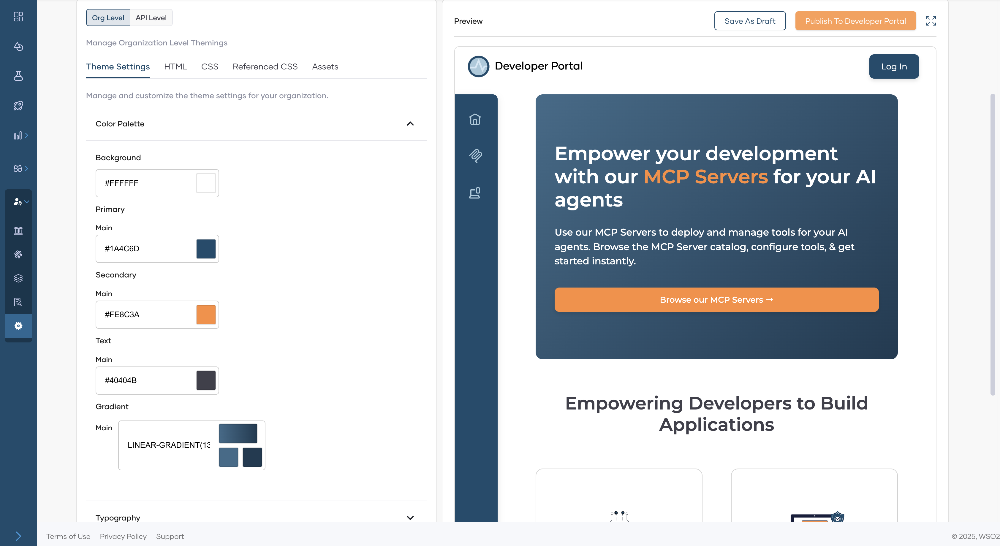

# Customize Developer Portal as an MCP Hub

Bijira’s developer portal is fully themeable to suit your needs. If you primarily work with MCP Servers, Bijira offers the flexibility to tailor the developer portal for a streamlined, MCP-centric experience. This curated view allows you to hide unrelated features, simplify navigation, and highlight only the tools, documentation, and Servers relevant to MCP use cases. Whether you're building integrations, exposing tools to LLMs, or managing contextual data sources, this focused setup helps reduce clutter and improves developer efficiency by surfacing only what matters most for MCP workflows.

You can get an MCP Server only view by changing the **Devportal Mode** to **MCP Hub** through your organization's settings. Please refer [this](../devportal/developer-portal-mode.md) for more information.

!!!info
    Bijira's MCP Inspector will be available as a testing tool in this mode.

The default look of your MCP Hub will be as follows.

A themed MCP Hub could look something like the following. If you want to know more on how you can customize the devportal, please refer to our [manual theming guide](../devportal/theming-devportal-org-level.md) and [theming with AI guide](../devportal/theming-devportal-with-ai.md).

