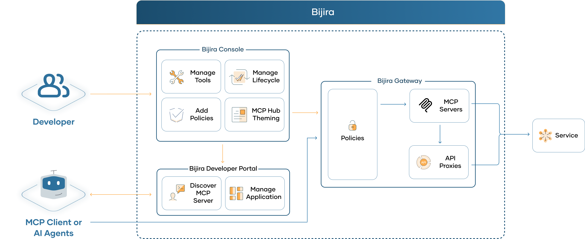

# Overview

## What is Model Context Protocol?

MCP is a JSON-RPC–based protocol designed to standardize how applications interact with large language models (LLMs). It enables sharing of contextual information—such as local files, databases, or APIs—with LLMs, while also allowing applications to expose tools and capabilities for AI-driven workflows and integrations.

MCP follows a host–client–server architecture and supports two primary transport mechanisms: stdio and streamable HTTP. While stdio is commonly used for local communication between clients and servers on the same machine, streamable HTTP is increasingly preferred for remote connections, especially as MCP adoption grows across networked environments. 

> **Note:**  
> The Model Context Protocol defines both `stdio` and streamable HTTP transports.  
> - `stdio` is designed for **local, process-level communication** (for example, between a CLI/IDE and a locally running MCP server).  
> - Streamable HTTP (SSE) is designed for **remote, network-based communication**.  
>  
> **MCP servers deployed on the WSO2 API Platform are hosted and accessed over the network. Therefore, only streamable HTTP (SSE) transport is supported.**  
> MCP clients connecting to API Platform must be configured to use streamable HTTP (SSE), not `stdio`.

For more information, refer to the official [specification](https://modelcontextprotocol.io/introduction).

## Remote MCP Servers with API Platform

> **Transport Requirement:**  
> Since API Platform exposes MCP servers as **remote, network-accessible endpoints**, it **does not support `stdio` transport**.  
> All MCP interactions with API Platform must use **streamable HTTP (SSE)**.

API Platform now includes support for MCP servers. It provides a complete solution for transforming existing APIs into intelligent, AI-ready tools. With a centralized control plane, API Platform simplifies the entire lifecycle of MCP server management—from creation to discovery—delivering a seamless experience for both API developers and AI agent builders. Additionally, API Platform allows you to customize the developer portal to deliver a tailored, MCP-only experience for your consumers.

In summary, API Platform provides the following capabilities related to MCP.

1. Create MCP Servers from existing API proxies or HTTP backends.
2. Automatically generate the MCP tool schemas.
3. Secure the MCP Servers with OAuth2 security.
4. Customize the Developer portal into an MCP Hub.

## MCP Use Cases with API Platform

- [Design and Publish MCP Servers for your APIs](design-mcp-servers.md)
- [Proxy Remote MCP Servers](proxy-remote-servers.md)
- [Customize the Developer Portal to an MCP Hub](devportal-mcp-hub.md)

