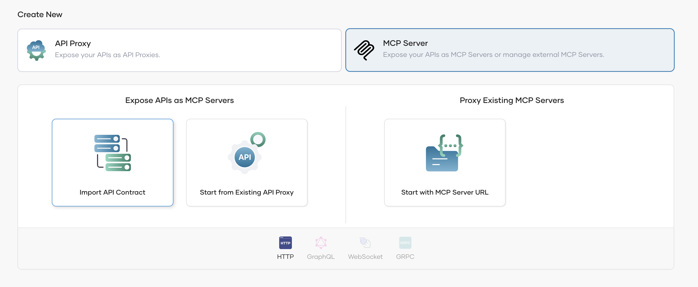
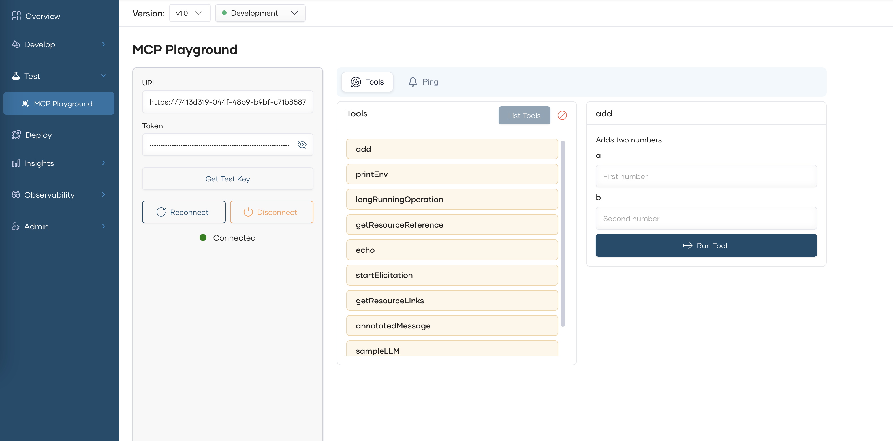

# Proxy Remote MCP Servers

Bijira allows you to proxy existing unsecured remote MCP servers by simply providing their URL. These proxied servers are automatically secured through the gateway, with quality-of-service features like rate limiting applied by default. Additionally, Bijira provides the capablity to manage the tools of your proxied MCP servers through the console.

## Create an MCP Server Proxy

You can use the Start with MCP Server URL option to create a new MCP Server proxy using an existing MCP Server.

!!!important
    Make sure you provide the complete url ending with **/mcp** as this will be used to connect and fetch the tools in the creation step.

    At the moment, Bijira supports only the **2025-03-16** specification. Therefore, it is important to make sure your MCP Server is 
    compatible with this specification version.
    

## Manage Tools of your MCP Server

You can modify the details of the Tools of your MCP Server by navigating to the Policy section under the Develop menu. The default tool names, descriptions, and schemas are taken from the actual MCP Server.

The following options are supported when modifying the Tools

1. **Add new Tool** - You can create a new tool by selecting the **+** icon at the top. You have to provide the name and description at this stage. The schema will be taken from the mapped tool of the underlying MCP Server.
2. **Edit Tool details** - You can modify the tool name and description of each tool by clicking on the Tool icon. The tool schema cannot be modified. If you modify the tool name, it will be converted to the actual tool name at the gateway during MCP tool calls.
3. **Delete Tools** - By default tools are created for all the tools available in your MCP Server. You can remove unwanted ones by deleting the tool. Only the selected tools will be given to the MCP client.

You have to **redeploy** the MCP Server after saving for the new changes to be reflected in the gateway.

## Test the MCP Server

You can test the MCP Server in the development environment before promoting it to production. Bijira provides an **MCP Playground** for this purpose.

1. Select **MCP Playground** under the Test section.
2. Select Development from the environment drop-down list (If you have deployed the MCP Server to other environments, you can select the respective options as well).
3. Click on **Get Test Key** if the test key is not populated
4. Click on **Connect** to connect with your deployed MCP Server.

You can select and call individual tools by providing the parameters if necessary.

## Publish the MCP Server

!!!important
    If you already have a Devportal themed published, please republish the theme before publshing the MCP Servers to Devportal.

Once you verify that the MCP Server is working as expected in the development environment, you can promote it to production.

1. In the left navigation menu, click **Deploy**.
2. In the Development card, click **Promote**.
3. In the Configuration Types pane, select the option Use Development endpoint configuration and click Next.

The Production card indicates the Deployment Status as Active when the MCP Server is successfully deployed to production.

If you want to verify that the MCP Server is working as expected in production, you can test the API in the production environment using the inbuilt MCP Inspector.

Now that your MCP Server is deployed in both development and production environments and can be invoked, the next step is to publish it so that consumers can discover and subscribe to it.

1. In the left navigation menu, click **Develop** and then click **Lifecycle**. This opens the Lifecycle page, where you can see the different lifecycle stages of the MCP Server. The default lifecycle stage is Created.
2. Click **Publish**.
3. In the Publish MCP Server dialog, click Confirm to proceed with publishing the MCP Server with the specified display name. If you want to change the display name, make the necessary changes and then click Confirm. This changes the lifecycle state to **Published**.

## Discover MCP Servers through Developer Portal

You can view the published MCP Server via the Developer Portal.

In the Lifecycle Management pane, click **Go to DevPortal**. This takes you to the MCP Server published to the Bijira Developer Portal.

!!!info
    If you need to do MCP specific customization to the Developer portal, please refer the [MCP Hub documentation](./devportal-mcp-hub.md).

Go to the MCP Server listing page using the left navigation menu and select your MCP Server

MCP consumers can discover the available tools through this view. Additionally, sample configurations for setting up the MCP Server with an MCP Client can also be obtained from here.

## Connect the MCP Server with MCP Clients / AI Agents

MCP Servers in Bijira are secured by default. To access them, you must subscribe through an application, obtain a valid token, and configure it in your MCP client.

For more information regarding managing applications, please refer [this](../devportal/manage-applications/create-an-application.md).

Please refer [this section](../devportal/manage-subscriptions/subscribe-to-an-api.md) to get an idea on how you can manage subscriptions to an application. Subscribing to MCP Servers is similar to how you subscribe to API Proxies.

!!!important
    If you created the MCP Server using an existing API Proxy, you need to subscribe to both using the same application.

Once you have the subscriptions in place, you need a valid OAuth2 token to connect with the MCP Server. You can refer to the [Generate Keys](../devportal/consuming-services/consume-an-api-secured-with-oauth2.md#generate-keys) section to get more information on how you can obtain a token.

If you are using **VS Code Copilot Agent** to test this out, you can copy the MCP Server Configuration from the overview and add that as a server configuration in [VS Code’s mcp.json](https://code.visualstudio.com/docs/copilot/chat/mcp-servers).

1. Replace the placeholder with the token you generated in the previous step.
2. Start the server through VSCode. If everything runs smoothly, it will connect within a few seconds and automatically detect the MCP Tools exposed by your MCP Server.
3. Now you can try out the tools through the chat option in copilot.

!!!important
    If you are using another AI Agent or an MCP Client, you need to configure the MCP server url and set the authorization token appropriately.

