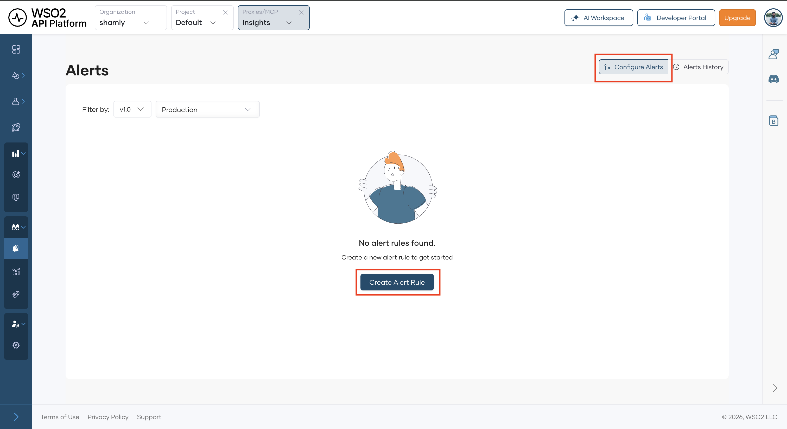

# Alerts Overview

This section explains how you can configure alerts for your API Platform Components. Setting up alerts allows you to proactively monitor your APIs ecosystem and take corrective measures when necessary.

!!! tip
    Setting up alerts is only available in the API level.

## Alert Types

API Platform supports the following types of alerts to help you monitor and manage your APIs effectively:

- [Latency alerts](#latency-alerts)
- [Traffic alerts](#traffic-alerts)
- [Status code alerts](#status-code-alerts)

### Latency Alerts

Latency alerts notify you if the response latency of a API exceeds a predefined threshold in a given time period. This is useful for APIs that need to meet specific SLAs and for proactively identifying slow components.

Configurable parameters

| **Parameter** | **Description**                                                                 |
|---------------|---------------------------------------------------------------------------------|
| Metric        | 99th, 95th, 90th, or 50th percentile.                                           |
| Threshold     | Latency in milliseconds (e.g.: 1800).                                           |
| Period        | Duration the threshold must be exceeded (e.g.: 5 minutes).                      |

### Traffic Alerts

Traffic alerts notify you when the request count of an API exceeds a predefined threshold. This is useful for managing APIs with backend traffic limits.

Configurable parameters

| **Parameter** | **Description**                                                                 |
|---------------|---------------------------------------------------------------------------------|
| Threshold     | Requests per minute (e.g.: 200).                                                |
| Period        | Monitoring window (e.g.: 5 minutes).                                            |

### Status Code Alerts

Status code alert triggers when your API returns specific HTTP error(s) (e.g.: **403** Forbidden, **500** Internal Error). These alerts help to detect issues affecting your component’s availability.

Configurable parameters

| **Parameter** | **Description**                                                                 |
|---------------|---------------------------------------------------------------------------------|
| Status Code   | Error code or series (e.g.: 400:Bad Request).                                   |
| Count         | Minimum number of occurrences (e.g.: 5).                                        |
| Interval      | Time window (e.g.: 5 minutes).                                                  |

## Configure Alert

Follow these steps to configure an alert:

1. Navigate to the API you wish to configure alerts for.
2. In the left menu, click **Observability** and then click **Alerts**.
3. Click **Create Alert Rule** to create a new alert rule.

    {.cInlineImage-full}

4. Select the **[Alert Type](#alert-types)** you want to create.
5. Select the **Environment** you want to create the alert for.
6. Select the **Version** as required for the API.
7. Configure the remaining fields specific to your selected alert type.
8. In the **Emails** field, specify the list of emails that should be notified when the alert is triggered.

    !!! note
        - When adding an email, enter the required email and press enter to add it.
        - You can add a maximum of 5 email addresses per alert.

9. You can configure additional parameters in **Advanced Configurations** dropdown as needed, which vary based on your alert type.
10. The **Explanation window** provides a concise summary of the configured alert based on your alert configurations.
11. Click **Create** to save and activate your alert rule.

    !!! info
        - You can configure a maximum of 10 alerts per API.

12. Once successfully added, your alert will be listed in the **Configure Alerts** pane alongside any existing alerts for the API.
13. Each alert can be **edited**, **removed** and **disabled** or **enabled** via this pane.

    !!! note
        when editing an alert, you can't edit the **Alert Type**, **Environment** and **Version**.

## Alert History & Notifications

### View Alert History

You can check the past alerts that have triggered for your API when you click the  **Alerts History** pane in the Alerts Page. You can filter the alert history by **Alert Type**, **Environment** or **Version** and **Time Range**.

You can click on an alert to expand it and see more details of the triggered alert.

### Email Notifications

When an alert is triggered, **recipients** added to the alert rule receive an email with **alert details** including a direct **Alert View link** to API Platform console.

