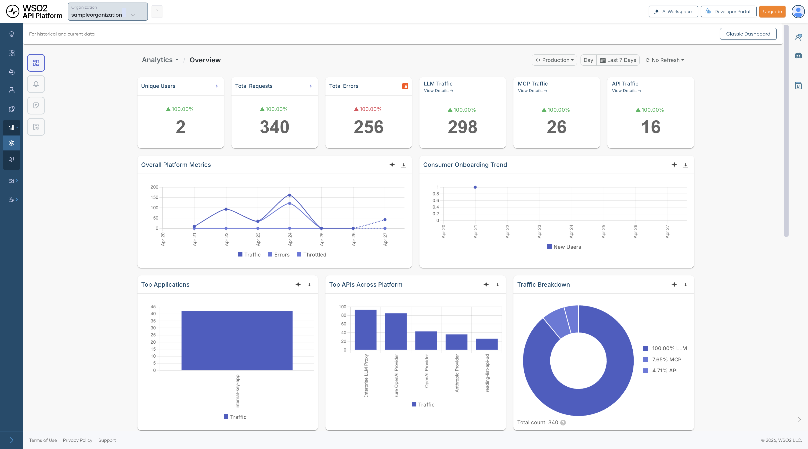

# Insights

Insights is now integrated into API Platform with Moesif, giving you visibility into your API usage directly from the console. You can monitor API traffic, track performance trends, and analyze usage patterns across your organization.

{.cInlineImage-full}

## Configure Insights for your organization

Insights uses Moesif as the underlying analytics platform. When you create a new organization on API Platform, Moesif is automatically provisioned and connected — no manual setup required.

!!! note
    If you created your organization **before 20/02/2026** and already have an existing Moesif organization that you want to connect, follow the [Integrate API Platform with Moesif](integrate-bijira-with-moesif.md) guide to configure the integration manually.
