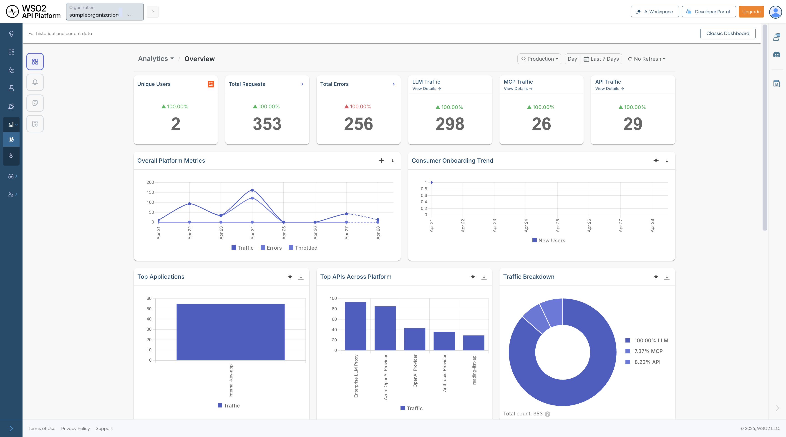
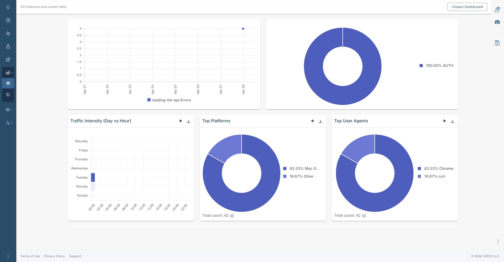
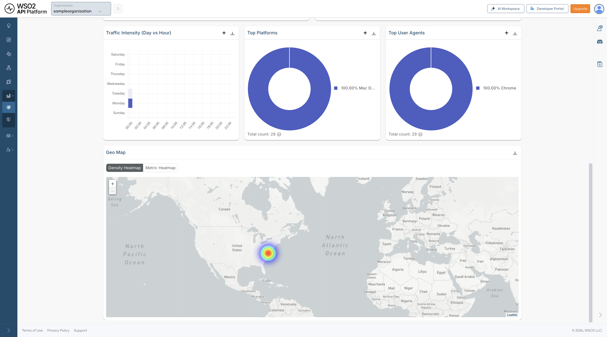

# Insights

Insights is now integrated into API Platform with Moesif, giving you visibility into your API usage directly from the console. You can monitor API traffic, LLM API usage, MCP activity, and overall platform health. Together, these dashboards help platform teams move from raw event data to operational insight by showing how traffic is distributed, where failures are occurring, which consumers are most active, and how usage changes over time.

Every dashboard supports configurable refresh intervals and time-range filters, making it possible to use the same dashboards for both short-term operational monitoring and longer-term trend analysis.

!!! note
    If you created your organization **before 20/02/2026** and already have an existing Moesif organization that you want to connect, follow the [Integrate API Platform with Moesif](integrate-bijira-with-moesif.md) guide to configure the integration manually.

## Filters

At the top of every Insights page you can filter data by:

- **Environment** – Switch between environments such as Production.
- **Time range** – Choose a preset period such as Day or Last 7 Days, or define a custom range.

---

## Overview

The Overview dashboard is the best place to start when you want a quick understanding of how the platform is behaving. It brings together high-level signals from API traffic, LLM requests, MCP tool calls, and consumer activity so you can identify whether the system is healthy before drilling into a more specialized dashboard.

This dashboard is especially useful for answering broad questions such as:

- Is the platform seeing unusual traffic or error volume right now?
- Are traffic increases concentrated in APIs, LLM usage, or MCP activity?
- Which applications, APIs, or regions are contributing most to the current load?

{.cInlineImage-full}

### Summary metrics

| Metric | Description |
|---|---|
| **Unique Users** | Number of users actively sending requests during the selected time window. This helps you understand how much live activity the platform is serving at a given point in time. |
| **Total Requests** | Total number of requests across APIs, LLM endpoints, and MCP activity. Use this as the top-level indicator of overall platform load. |
| **Total Errors** | Total number of failed requests across all monitored traffic. A sudden increase usually indicates an issue that should be investigated in one of the drill-down dashboards. |
| **LLM Traffic** | Total number of LLM requests in the selected time range. This helps you understand how much of the overall traffic is coming from AI-enabled workloads. Click **View Details** to drill down. |
| **MCP Traffic** | Total number of MCP tool call events in the selected time range. This is useful for tracking agent-initiated activity across MCP servers and tools. Click **View Details** to drill down. |
| **API Traffic** | Total number of API calls processed across all supported API types. Compare this with LLM and MCP activity to understand the dominant traffic pattern on the platform. Click **View Details** to drill down. |

### Overall Platform Metrics

Shows traffic, errors, and throttled requests over time. Use it to see whether spikes in traffic align with failures or throttling, and to distinguish between demand-related issues and more isolated failures.

### Consumer Onboarding Trend

Tracks new consumer registrations over time. This is useful for understanding growth, measuring the effect of onboarding or product changes, and identifying whether increased traffic is being driven by new adoption.

### Top Applications

Ranks applications by traffic volume so you can identify the consumers generating the most load. This is particularly helpful when planning capacity, investigating noisy consumers, or prioritizing customer-facing support.

### Top APIs Across Platform

Highlights the most frequently called APIs across all traffic types. This helps you identify which APIs are most critical to day-to-day traffic and therefore most important for reliability, optimization, and incident response.

### Traffic Breakdown

A pie chart showing the proportion of total traffic by gateway type — **LLM**, **MCP**, and **API**. Use this to understand how traffic is distributed across your platform.

### Traffic Intensity (Day vs Hour)

Displays request volume by day of week and hour of day. Use it to spot recurring usage patterns, plan maintenance windows, and prepare infrastructure for predictable peak periods.

### Top Platforms

Shows the distribution of operating systems used by consumers. This helps you understand the client environments accessing your platform and can inform client compatibility or support decisions.

### Top User Agents

Breaks down request traffic by HTTP user agent so you can distinguish browser, SDK, and automated traffic. It is useful when you want to understand how users and integrations are interacting with your platform.

### Average Latency over Time

Tracks average response latency across the platform. Sustained increases can point to backend degradation, upstream issues, or load-related performance problems that require deeper investigation.

### Geo Map

Shows where requests originate geographically. Switch between **Density Heatmap** and **Metric Heatmap** views. This can help with decisions around regional deployments, CDN placement, compliance planning, and understanding where user demand is concentrated.

---

## LLM Traffic

The LLM Traffic dashboard provides observability for LLM usage on API Platform. It helps you track provider and model adoption, token consumption, estimated cost, latency, guardrail activity, and semantic cache performance.

This dashboard is especially useful for teams building AI-powered experiences because it combines operational insight with cost visibility. Instead of looking only at traffic volume, you can also understand how requests are distributed across providers and models, how much those requests are costing, and whether safeguards such as guardrails or semantic caching are working as expected.

### Summary metrics

| Metric | Description |
|---|---|
| **Unique Consumers** | Number of distinct users or applications calling LLM endpoints. This helps you understand how broadly AI features are being adopted. |
| **Total Requests** | Total number of LLM inference requests in the selected time range. Use this as the main demand indicator for AI workloads. |
| **Average Error Rate** | Percentage of LLM requests that failed. This helps you monitor the reliability of AI features across providers and models. |
| **Token Usage** | Total tokens consumed across all requests, including prompt and completion tokens. This is one of the most important signals for understanding LLM usage patterns. |
| **Estimated Cost** | Approximate cost of token usage based on provider pricing. This helps you connect usage growth to financial impact. |
| **Average Latency** | Mean end-to-end response time for LLM requests. This is important for understanding user-perceived responsiveness in AI-assisted features. |

### Charts and visualizations

**Requests by Provider** — Shows request volume by LLM provider so you can understand provider distribution and traffic share. This is useful when comparing vendor usage, planning failover strategies, or managing commercial dependencies.

**Traffic Share by Model** — Shows how traffic is distributed across models, helping you monitor adoption and dependency on specific models. It can also help you identify whether expensive or experimental models are being used more heavily than expected.

**Guardrail Triggers** — Shows how often each guardrail is triggered. This can help you tune thresholds, identify recurring policy issues, and understand whether requests are frequently being blocked or altered by safety controls.

**Token Usage over Time (Prompt vs Completion)** — Separates prompt and completion token usage over time so you can better understand input and output patterns. This is useful for identifying cases where prompts are too large, responses are unexpectedly verbose, or usage is growing inefficiently.

**Error Type Breakdown** — Categorizes LLM errors to help determine whether failures come from policy violations, authentication problems, rate limits, or provider-side issues.

**Cost Trend (Estimated USD)** — Tracks estimated LLM spend over time for budgeting, anomaly detection, and cost forecasting. This is especially useful when adoption is growing and cost needs to be monitored closely.

**Request Intensity (Day vs Hour)** — Shows when AI features are used most heavily by mapping request volume across days and hours. Use it to understand peak demand windows and align scaling or cost controls accordingly.

**Latency Trend (P90, Median)** — Shows both median and tail latency, helping you spot user experience issues that averages may hide. Tail latency is particularly important for conversational or interactive AI features.

**Slowest Models** — Lists models by average latency, along with provider and error counts, so you can identify underperforming models and make better decisions about model selection.

**Semantic Cache Hit Ratio** — Shows the overall cache efficiency. A high ratio means similar prompts are being served from cache, reducing both latency and cost while improving consistency for repeated requests.

**Semantic Cache Hit over Time** — Shows how cache effectiveness changes over time as prompt patterns evolve. This helps you understand whether semantic caching is becoming more or less useful as user behavior changes.

---

## MCP Traffic

The MCP Traffic dashboard provides visibility into Model Context Protocol server activity. It helps you monitor tool call volume, consumer sessions, error rates, and traffic distribution across MCP servers and clients.

This dashboard is useful when AI agents or MCP-enabled clients are interacting with tools exposed through your platform. It helps you understand which tools are being used most often, whether agents are succeeding or failing, and how activity is distributed across MCP servers and client environments.

### Summary metrics

| Metric | Description |
|---|---|
| **Tool Calls** | Total number of MCP tool invocations in the selected time range. This is the main indicator of MCP tool usage volume. |
| **Unique Consumers** | Number of distinct users or agents calling MCP tools. This helps you understand how broadly MCP capabilities are being used. |
| **Error Rate** | Percentage of MCP tool calls that resulted in an error. Use this to monitor the reliability of tool execution across MCP interactions. |
| **Unique Sessions** | Number of distinct MCP sessions, typically representing individual agent or client interactions. This helps you estimate how many separate MCP conversations or runs are taking place. |

### Charts and visualizations

**Traffic Volume over Time** — Shows MCP event count together with latency so you can identify spikes in activity or slower tool execution. This is useful when diagnosing whether increased tool usage is affecting response time.

**Top Tools by Calls** — Ranks MCP tools by invocation count, helping you identify heavily used tools and prioritize reliability improvements, performance tuning, or governance around the most critical tools.

**Unique Consumers over Time** — Tracks how the number of distinct MCP consumers changes over time, which is useful for measuring adoption and understanding whether MCP usage is expanding across teams or integrations.

**Traffic Intensity (Day vs Hour)** — Shows when agents are most active by mapping tool call volume across days and hours. This helps you understand agent behavior patterns and identify periods of concentrated tool usage.

**Error Rate Trend** — Shows how MCP error levels change over time so you can correlate spikes with tool changes, client behavior changes, or upstream outages.

**Error Type Breakdown** — Categorizes MCP errors, including parse errors, invalid requests, missing methods, invalid parameters, internal errors, and server errors. This helps you distinguish malformed client requests from implementation gaps or server-side failures.

**Server Distribution** — Shows which MCP servers are handling traffic so you can understand load distribution across your MCP server fleet and identify over-reliance on a particular server.

**Client Distribution** — Shows the distribution of MCP clients by type, helping you identify which runtimes or development environments are driving usage and where MCP adoption is strongest.

---

## API Traffic

The API Traffic view provides analytics by API type, covering REST, Async, GraphQL, gRPC, and SOAP traffic. It helps you understand not just how much API traffic the platform is handling, but also which protocol types are most active, where errors are concentrated, and how performance changes across different API styles.

This dashboard is useful for questions such as:

- Which API protocol contributes the most traffic?
- Is an increase in latency affecting all API traffic or only a subset?
- Are failures spread across the platform or concentrated in one type of API?

### Summary metrics

| Metric | Description |
|---|---|
| **Total Requests** | Total number of API calls across all API types in the selected time range. This gives you the broadest view of platform API demand. |
| **Average Latency** | Mean response time across all API requests. Use this as a high-level performance indicator before investigating protocol-specific dashboards. |
| **Error Rate** | Percentage of API requests that resulted in an error. This helps you determine whether failures are isolated or widespread across API traffic. |
| **Unique Consumers** | Number of distinct users or applications making API calls. This indicates how broadly the APIs are being used across your consumer base. |

### API type breakdown

Cards for each protocol type let you quickly compare relative traffic volumes and navigate to the corresponding drill-down views:

| API Type | Description |
|---|---|
| **REST API Traffic** | Number of REST API calls. Click **View Details** to drill further. |
| **Async API Traffic** | Number of asynchronous API calls, such as event-driven or message-based requests. |
| **GraphQL API Traffic** | Number of GraphQL queries and mutations. |
| **gRPC API Traffic** | Number of gRPC remote procedure calls. |
| **SOAP API Traffic** | Number of SOAP/XML web service calls. |

### Traffic Volume over Time

Shows request count and average latency on the same chart, making it easier to correlate traffic growth with performance changes. It is especially helpful for checking whether rising usage is contributing to slower responses.

### Error Type Breakdown

Breaks errors into categories so you can quickly identify the most common failure type. This gives you an immediate sense of whether issues are mostly related to authentication, client behavior, backend systems, or other causes.

### Error Rate Trend

Shows how the error rate changes over time. This is especially useful for spotting regressions after deployments, validating fixes, and identifying intermittent issues that may not appear in aggregate metrics.

{.cInlineImage-full}

### Traffic Intensity (Day vs Hour)

Highlights when demand is highest by showing request volume by day and hour. Use it to understand recurring demand patterns and to align scaling or maintenance activities with real usage behavior.

### Top Platforms

A pie chart showing the distribution of API calls by client platform.

### Top User Agents

A pie chart showing the distribution of API calls by user agent.

---

## REST API Detail

The REST API detail view is a protocol-specific drill-down for REST traffic. Click **View Details** on the REST API Traffic card in the API Traffic dashboard to open this view. You can also filter by a specific API using the **API** search field at the top.

Because REST traffic often represents the largest share of gateway traffic, this dashboard is particularly useful for day-to-day operational monitoring, troubleshooting client-facing issues, and identifying optimization opportunities.

### Summary metrics

| Metric | Description |
|---|---|
| **Total Requests** | Total number of REST API calls in the selected time range. Use this to gauge the overall scale of REST traffic. |
| **Average Latency** | Mean response time for REST requests. This is a key indicator of the responsiveness of your REST APIs. |
| **Error Rate** | Percentage of REST requests that returned an error. This helps you quickly determine whether consumers are experiencing failures at a significant rate. |
| **Unique Consumers** | Number of distinct consumers calling REST APIs. This reflects how widely REST APIs are being adopted across applications and users. |

### Traffic Volume over Time

Shows REST request volume together with latency so you can spot periods where rising demand may be affecting performance. This is one of the quickest ways to identify whether slowdowns are traffic-related.

### Error Type Breakdown

Categorizes REST errors to help determine whether failures are caused by authentication issues, invalid requests, rate limiting, or server-side problems.

### Error Rate Trend

Shows how REST error levels change over time, making it easier to pinpoint when a problem started and whether it is improving or worsening.

{.cInlineImage-full}

### Traffic Intensity (Day vs Hour)

Displays peak usage periods for REST consumers by day and hour. This helps you understand normal traffic rhythm and identify the best times for maintenance or load testing.

### HTTP Status Codes over Time

Breaks responses into 2xx, 4xx, and 5xx classes so you can separate successful requests from client-side and server-side failures. This is useful for determining whether a problem is caused by consumer behavior or backend instability.

### Application Usage Detail

Lists the applications using the REST APIs, along with owner, usage count, error rate, and average latency. This helps identify which consumers are generating the most load, which ones are seeing the most errors, and which integrations may require follow-up.

### REST API Usage over Time

Shows traffic trends for individual REST APIs, making it easier to track which APIs are growing, declining, or behaving unusually. It is useful when investigating issues affecting a specific API rather than the entire REST layer.

### Cache Hit Percentage

Tracks total hits, cache hits, and hit percentage over time. Higher cache hit rates usually reduce backend load and improve response times, so this chart helps you understand whether caching is working effectively.

### Cache Latency

Shows the latency associated with cached responses so you can understand the performance benefit of caching and whether cached responses are materially improving user experience.

### Top Platforms

Shows the operating systems used by REST API consumers. This gives you a better understanding of the environments from which REST traffic originates.

### Top User Agents

Shows the HTTP clients, browsers, SDKs, or tools making REST API calls. This can be helpful when diagnosing traffic patterns tied to a specific client or integration.

### Geo Map

Displays the geographic origin of REST API traffic, with support for both **Density Heatmap** and **Metric Heatmap** views. Use it to understand regional demand and identify whether location-specific patterns are affecting usage or performance.

!!! note
    Clicking any API type traffic card (REST, Async, GraphQL, gRPC, or SOAP) in the API Traffic dashboard opens a drill-down dashboard for that protocol. Each drill-down follows the same layout as the REST API detail view described above.
