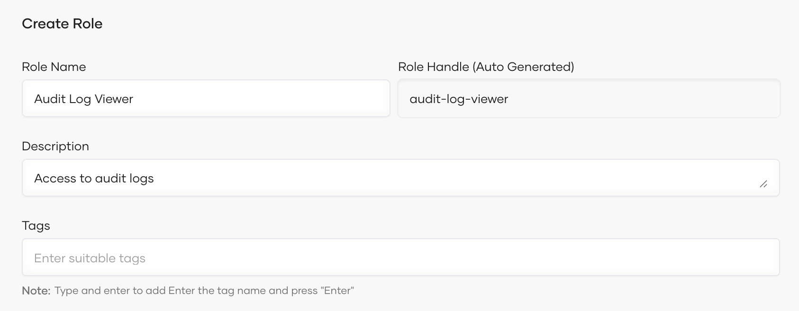
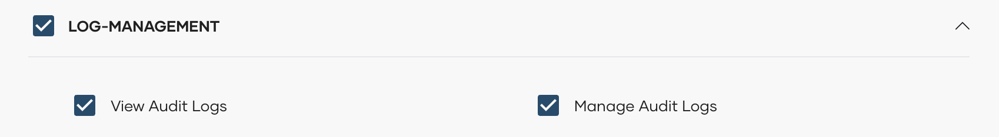

# Audit logs

Audit logs, also called audit trails, enhance security, ensure compliance, provide operational insights, and help manage risks. 

In Bijira, an audit log records organization-level user-specific operations performed via the Bijira Console. It also captures the timestamp and the outcome of the action. 

As of now, Bijira captures the following user-specific operations as audit logs:

- Project creation, update, and deletion.
- API Proxy creation, update, and deletion.
- API Proxy promotion initiation.
- API Proxy version creation.
<!-- - Component deployment, redeployment, and undeployment initiation for all components other than REST API Proxy components. -->
<!-- - Component API access mode update. -->
<!-- - Enabling and disabling component auto-deployment on commit.  -->
<!-- - Component build configuration update. -->
<!-- - Component endpoint creation, update, and deletion. -->
- Organization user management.
- On-premises key management.
- Project-level configuration management.

In Bijira, organization administrators are allowed to view audit logs by default. If other members need to access organization-specific audit logs, the administrator can create a role with the relevant permission and assign it to members. For step-by-step instructions on how to create and assign a role with relevant permission, see [Manage audit log access](#manage-audit-log-access).

To view audit logs, follow these steps:

1. Sign in to [Bijira](https://console.bijira.dev/).
2. In the Bijira Console, go to the top navigation menu and click **Organization**.
   
    !!! tip
         As of now, you can only view organization-level audit logs.

3. In the left navigation menu, click **Admin** and then click **Audit Logs**. This displays audit logs for the past 30 days by default.

    To view audit logs based on a specific time range and other requirements, you can apply the necessary filter criteria.

    

## Audit log retention

Bijira retains audit logs for one year and archives them for an additional year. Therefore, the total retention period for audit logs is two years.

## Manage audit log access

Follow the steps given below to create a role with audit log access permission and assign it to organization members who need access to audit logs:

!!! info "Note"
        You must be the organization administrator to perform this action.

### Step 1: Create a role with audit log access permission

1. In the Bijira Console, go to the top navigation menu and click **Organization**.
2. In the left navigation menu, click **Admin** and then click **Settings**.
3. On the **Access Control** tab, click **Roles** and then click **+ Create Role**.
4. Enter a name and description for the role.
   
     {: style="width:700px"}

5. Click **Next**.
6. In the **Create Role** dialog, select **LOG-MANAGEMENT** under **Permissions**.

     {: style="width:700px"}

7. Click **Create**.  

### Step 2: Assign the created role to an organization member

1. On the **Access Control** tab, click **Groups**. This lists the groups of the organization with their respective details.
2. Select the group that you want to assign the role to and click Edit button.
3. Click the **Roles** tab, and then click **+ Add Roles** to add a new role to the group. Then add the role you created in [Step 1](#step-1-create-a-role-with-audit-log-access-permission) and click **Add**.
   
    !!! tip
         If you want to invite one or more members and assign them the audit log viewer role, follow the steps given below:

           1. Click **+ Invite Member** and then click to expand the **Roles** list.
           2. Select the role you created in [Step 1](#step-1-create-a-role-with-audit-log-access-permission).
           3. In the **Emails** field, enter the email addresses of members you want to invite and grant permission to access audit logs.
           4. Click **Invite**. This sends an invitation email to each email address so that the members can accept and obtain access to view audit logs.
