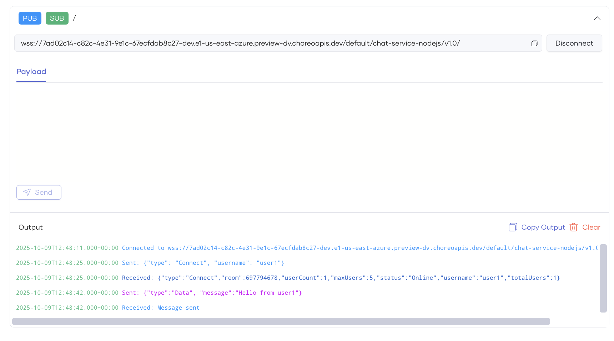

# Test WebSocket Endpoints via the WebSocket Console

Bijira offers an integrated WebSocket Console to test WebSocket endpoints for the API proxies you create and deploy. Since Bijira secures WebSocket APIs with OAuth 2.0 authentication, the WebSocket Console generates test keys to help you test your APIs.

Follow these steps to test a WebSocket endpoint using the WebSocket Console:

1. Go to the [Bijira Console](https://console.bijira.dev/) and log in.
2. Select the project and API which you want to test.
3. Click **Test** in the left navigation menu, then select **Console**. This will open the **WebSocket Console** pane.
4. In the **Console** pane, select the desired environment from the drop-down menu.

    {.cInlineImage-full}

5. Expand the topic you want to test.
6. Provide values for any parameters, if applicable.
7. Click **Execute** or **Connect**. The output will be displayed under the **Output** section.
