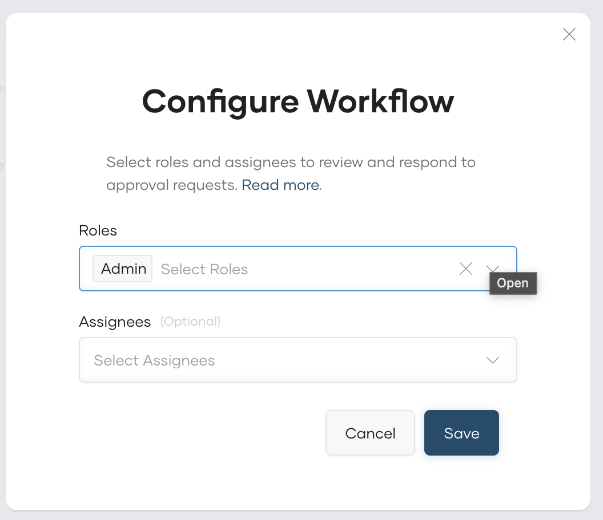

# Configure Approvals for Bijira Workflows

Bijira allows you to configure approval processes for specific workflows within the platform. An approval process for a workflow ensures that critical or sensitive changes are properly managed and controlled.

Bijira currently allows you to configure approvals for environment promotion and URL customization workflows.

Configuring approvals for environment promotion allows authorized users to control components being promoted to a critical/production environment.

Configuring approvals for URL customization workflows allows you to control custom URL mappings by requiring review and approval before the customization is applied.

## Permissions to review and respond to approval requests

Click the respective tab for details on permissions depending on the workflow for which you want to configure approvals:

=== "Environment promotion"

     To review and respond to environment promotion approval requests, a user must have the following permissions. Administrators must ensure that users designated to review and respond to approval requests have these permissions:

      - **WORKFLOW-MANAGEMENT**:
          - Approve component promotion requests: Grants access to review and approve the promotion of components to critical environments.

=== "URL customization"

     To review and respond to URL customization approval requests, a user must have the following permissions. Administrators must ensure that users designated to review and respond to approval requests have these permissions:

      - **WORKFLOW-MANAGEMENT**:
          - Approve custom URL mapping requests: Grants access to review and approve custom URL mapping requests.
      - **URL-MANAGEMENT**:
          - Manage Custom Domains: Grants access to manage custom domains for the organization.

!!! note
     Approval permissions can be given to users in organization scope or project scope (by assigning user groups to roles at project level). Users having project level permissions can see and review approval requests originated from permitted projects only.

## Set up an approval process for a workflow

To set up an approval process for a workflow, follow these steps:

!!! note
     - You must have administrator privileges in Bijira to configure workflow approvals.
     - Administrators can designate specific roles and assignees to receive notifications associated with each workflow.

1. Sign in to the [Bijira Console](https://console.Bijira.dev/).
2. In the Bijira Console header, go to the **Organization** list and select your organization.
3. In the left navigation menu, click the **Admin** Drop down and then click **Settings**. This opens the organization-level settings page.
4. Click the **Workflows** tab.
5. Turn on the workflow you want to enable by clicking the relevant status toggle.
6. Configure roles and assignees to receive notifications, review and respond to workflow approval requests if needed and press **Save**.

     {: style="height:400px;width:400px"}
     
    - In the **Roles** field, select one or more roles depending on your preference. All users assigned to the selected roles will be eligible to receive notifications. Scope of notification delivery depends on the role assignment level when [configuring permissions](#permissions-to-review-and-respond-to-approval-requests):
         1. Project level roles-to-group assignment: Users in these groups will receive notifications only for approval requests raised within the specific project where the role is assigned.
         2. Organization level roles-to-group assignment: Users in these groups will receive notifications for approval requests raised across all projects in the organization.
    - In the **Assignees** field, select specific users to be Assignees. Assignees can be any Bijira user, even if they are not assigned to a selected role.

    !!! info "Important"
         Only roles having [relevant approval permission](#permissions-to-review-and-respond-to-approval-requests) can be selected to receive notifications, so that respective users can always review and respond to requests. However, users in Assignees field are there for notification purpose only, they may not have required privileges to review and approve requests.

Once you enable the approval process for a workflow, see the following details on how to submit a request for approval and the approval process. Click the respective tab depending on the workflow for which you enabled the approval process:

=== "Environment promotion"

     Once you enable an approval process for environment promotion, developers must [submit a request for approval to use the workflow](./submit-workflow-requests.md). An authorized assignee must then [review and approve the request](./review-workflows-requests.md) for a developer to proceed with the task related to the workflow.

=== "URL customization"

     Once you enable an approval process for URL customization, developers must [submit a request for approval to configure a custom URL for a component](./submit-workflow-requests.md). Instead of being automatically deployed, the URL mapping will go into a pending state. An authorized approver must then [review and approve the request](./review-workflows-requests.md) before the custom URL is activated for the respective component.
