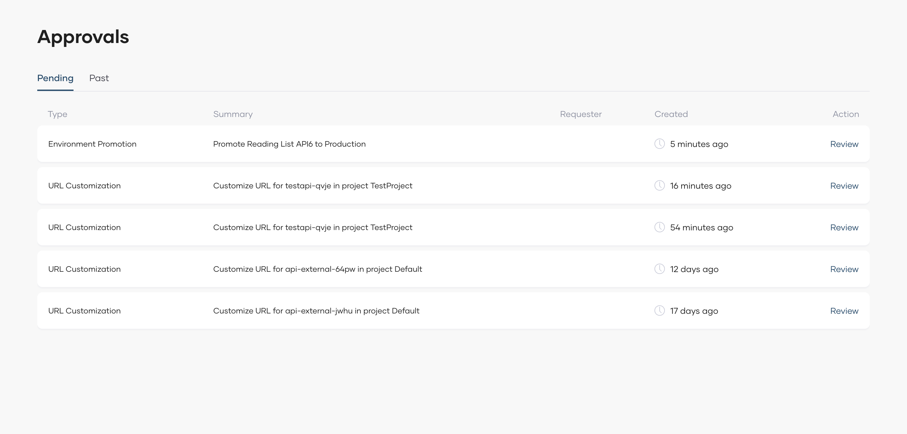

# Review Workflow Approval Requests

In Bijira, administrators can [configure approvals for workflows](./configure-workflow-approvals.md) and assign specific users as approvers.

If you are assigned as an authorized reviewer for a particular workflow approval request, you will receive an email notification when a [request is submitted for approval](./submit-workflow-requests.md). The email includes a summary of the request.

!!! note
     - Workflow approvals are managed at the project level. If a role with the necessary permissions is assigned in a project context, only members of the user group bound to that role within the specific project will receive notifications for requests made in that project. For example, if you are assigned the Project Admin role (which includes the necessary permissions) for project A, you will only be notified of workflow requests within project A.
     - Users with organization-level permissions will receive notifications for all workflow requests across any project in the organization.

Other approvers within your organization will also receive notifications for workflow requests and may review a request before you. If a request has already been reviewed, it will appear under the **Past** tab on the **Approvals** page.

Approval requests are submitted on behalf of the team. Once approved, any authorized team member can execute the task. For certain tasks, execution may occur automatically upon approval.

## View workflow approval requests

To view workflow approval requests assigned to you, follow these steps:

1. Sign in to the [Bijira Console](https://console.bijira.dev/).
2. In the Bijira Console header, go to the **Organization** list and select your organization.
3. In the left navigation menu, click the **Admin** drop-down and then click **Approvals**. This opens the **Approvals** page where you can see all approval requests assigned to you. The **Pending** tab lists requests that are yet to be reviewed. The **Past** tab displays requests already reviewed by you or other approvers, as well as requests canceled by the requester.

4. To view details of a specific request, click **Review** corresponding to it.

## Approve or reject an approval request

To approve or reject a request, follow these steps:

1. Follow the instructions in the [View workflow approval requests](#view-workflow-approval-requests) section above to see details of the workflow you want to review.
2. Review the request and click **Approve** or **Reject** based on your decision.

