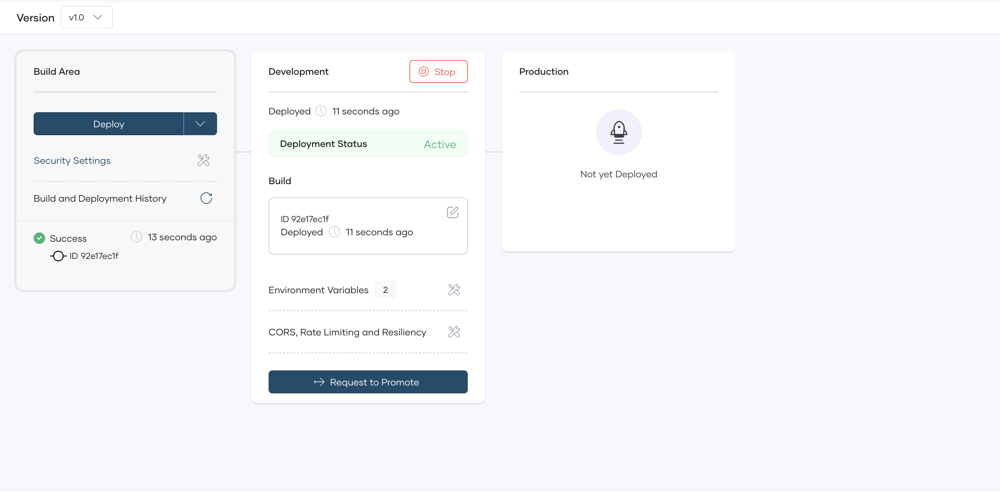
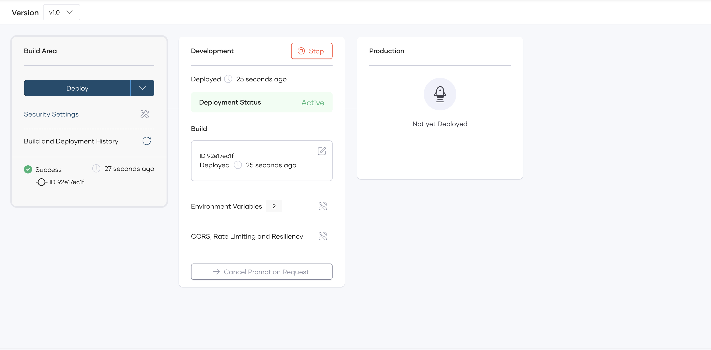
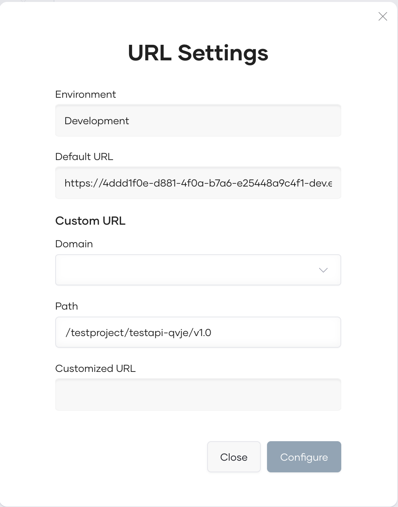
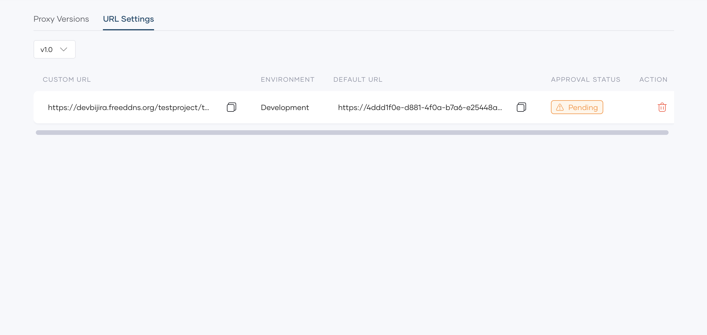

# Submit Workflow Approval Requests

In Bijira, if an administrator [configures a workflow to require approval](./configure-workflow-approvals.md), you must submit a request to obtain approval to perform the task.

When you submit a workflow approval request, Bijira notifies all authorized reviewers via email. Once an authorized reviewer approves or rejects the request, you will receive an email with the decision details. See [Review Workflow Approval Requests](./review-workflows-requests.md) for more information on workflow approval request reviews.

The approach to request approval can vary depending on the workflow. Click the relevant tab:

=== "Environment promotion"

    ## Request approval for environment promotion

    **Prerequisites**:

    - Ensure you have an api proxy created, built, and deployed to the first environment of your [CD pipeline](../administer/manage-cd-pipelines/manage-cd-pipelines.md).
    - Ensure that an approval workflow is configured for environment promotion.
    - Ensure you are promoting the api proxy to a critical environment, such as production.

    To request approval to promote an api proxy from the development environment to production, follow these steps:

    1. Sign in to the [Bijira Console](https://console.Bijira.dev/).
    2. In the **api proxy Listing** pane, click on the api proxy you want to deploy. This takes you to the **Overview** page of the api proxy.
    3. In the left navigation menu, click **Deploy**.
    4. Go to the **Development** card and click **Request to Promote**.
    
    5. In the **Request Approval** pane, enter your request details and click **Submit**. This creates a request and notifies all authorized assignees via email about the request.

    !!! note
         When an environment promotion request for a specific api proxy is pending review, Bijira restricts other developers from making the same request until the pending request is either approved or rejected.

    When an authorized assignee approves the request, you will receive a confirmation email and can proceed to promote the api proxy to production.

    **Cancel a pending request:**

    If you want to cancel a workflow approval request that is already submitted, you can do so before the request is approved or rejected. 

    When you submit a workflow approval request, the **Request to Promote** button changes to **Cancel Request**. To cancel an approval request, click **Cancel Request**. Upon confirming the cancellation, all configured approvers are notified immediately, and the request will no longer be pending.

    

=== "URL customization"

    ## Request approval for URL customization
   

    **Prerequisites**:

    - Ensure you have an api proxy created, built, and deployed.
    - Ensure that an approval workflow is configured for URL customization.
    - Prepare the desired custom URL for your api proxy, and ensure an administrator has configured your organization to use it.

    To request approval to configure a custom URL for an api proxy, follow these steps:

    1. Sign in to the [Bijira Console](https://console.Bijira.dev/).
    2. In the **api proxy Listing** pane, click on the api proxy you want to configure. This takes you to the **Overview** page of the api proxy.
    3. In the left navigation, click the **Admin** drop-down and then click **Settings**.
    4. Click the **URL Settings** tab. This displays the active deployments of the component across different environments and indicates whether a custom URL is configured.
    5. To configure a custom URL for a component in a specific environment, click the **Edit URL Mapping icon** under the Action column corresponding to the respective environment. This opens the URL Settings dialog, where you can specify values to add to a custom URL.
    6. After specifying the required details, click **Configure** to submit your approval request.

    {: style="height:500px;width:380px"}

    If your approval request is successful, you will see a **Pending** status in the approval status column for the environment you configured.

    

    !!! note
         While a custom URL request for an api proxy is pending, you cannot submit another request for the same api proxy until the pending request is approved or rejected.
    Once the request is approved, the custom URL will be applied to the relevant proxy component.
