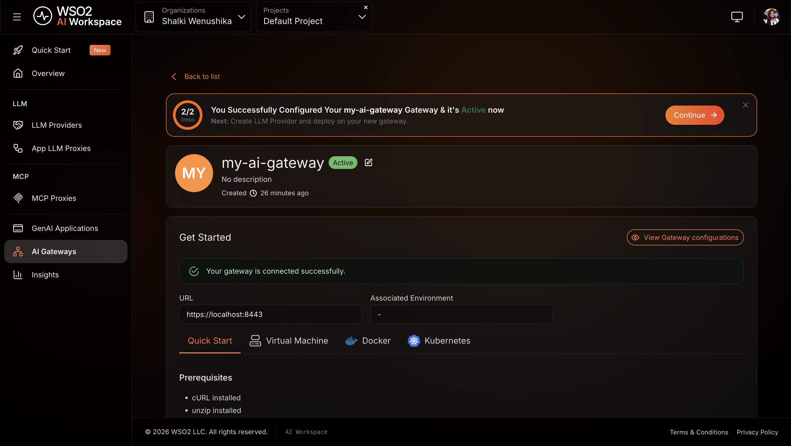
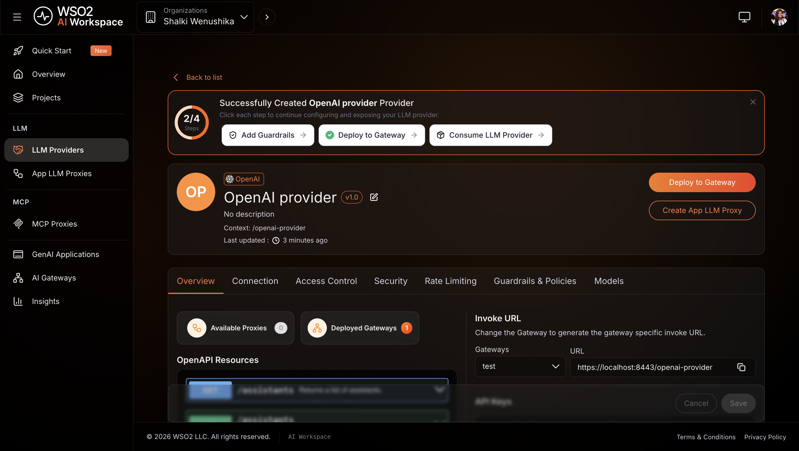
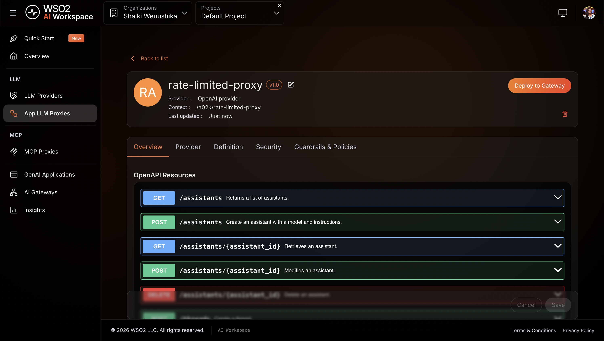
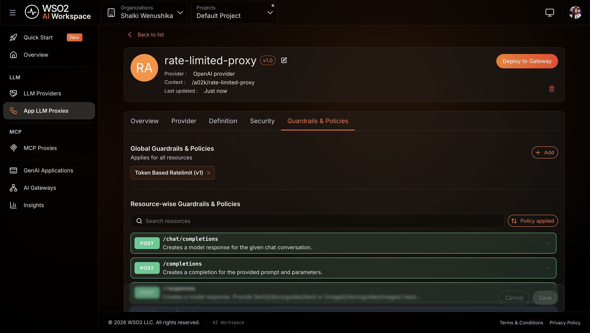
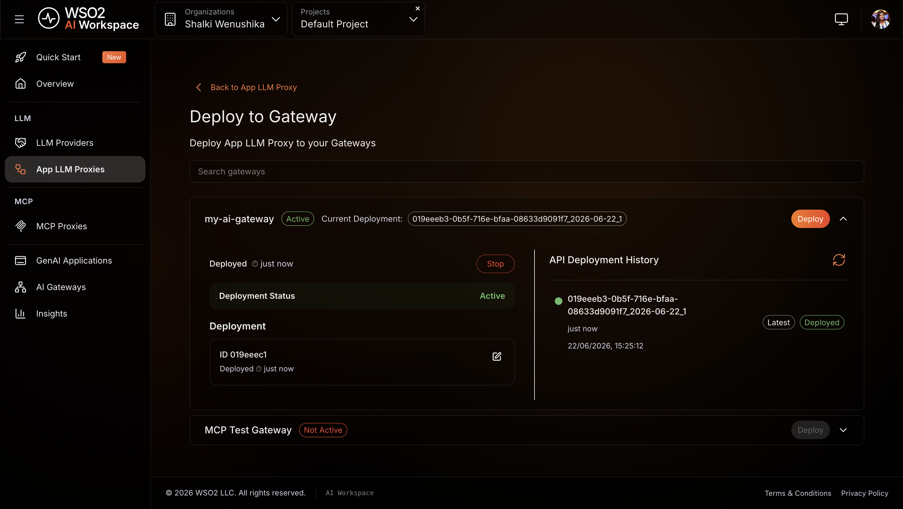

# Enforce token-based rate limiting on an LLM proxy

## Overview

This guide shows you how to put a token quota on an LLM proxy so no single application can exhaust your OpenAI budget in a burst. Without this, any caller can drain your token allowance before you notice and your provider rate limits apply without warning. By the end, you'll have a live LLM proxy that blocks further requests with `HTTP 429` once the quota is reached. A companion sample is available to run locally and verify the same behavior without real credentials.

## Learning objectives

- Register an OpenAI LLM provider so the gateway holds the API key and your applications don't
- Create an LLM proxy that sits in front of OpenAI and serves as the single entry point for your applications
- Attach a token-based rate limit policy that caps token consumption within a rolling time window
- Verify that the gateway enforces the quota and returns `HTTP 429` once the limit is reached

## Prerequisites

- A WSO2 API Platform account. [Sign up for free](https://console.bijira.dev).
- An OpenAI API key
- `curl` for testing

## Architecture

```
Your application
    |  HTTPS + API key
    v
+---------------------------------------+
|  WSO2 AI Gateway                      |
|  [ LLM Proxy ]                        |
|  auth · rate limiting · audit logging |
+---------------------------------------+
    |  HTTPS + OpenAI API key
    v
OpenAI API
```

The LLM proxy is deployed on the AI Gateway, which sits between your application and OpenAI. The AI Gateway authenticates incoming requests using an API key, tracks token consumption from each OpenAI response, and blocks new requests once the configured quota is reached within the time window. Your application never holds the OpenAI API key.

## Step 1: Create an organization and project

Go to the [WSO2 AI Workspace](https://ai-workspace.bijira.dev/) and sign in with your Google, GitHub, or Microsoft account.

If this is your first time signing in, you'll be prompted to create an organization. Enter a name, accept the privacy policy and terms of use, and click **Create**.

Once you're on the organization home page, create a project:

1. Click **+ Create Project**.
2. Enter the following details:

    | Field | Value |
    |---|---|
    | **Display Name** | Sample Project |
    | **Identifier** | sample-project |
    | **Description** | My sample project |

3. Click **Create**.

**Expected result:** The project home page opens.

## Step 2: Create and start an AI gateway

The AI gateway is the runtime that hosts your proxy and enforces your policies. If you already have a gateway running and shown as **Active** in the console, skip this step and proceed to Step 3.

**Create the gateway:**

1. In the left navigation menu, click **AI Gateways**.
2. Click **+ Add AI Gateway**.
3. Enter the following details:

    | Field | Value |
    |---|---|
    | **Name** | my-ai-gateway |
    | **Associated Environment** | Production |

4. Click **Add Gateway**.

!!! warning
    The gateway detail page shows a **Gateway Registration Token** once, in the **Get Started** section. Copy and store it before leaving the page. If you lose it, click **Reconfigure** to generate a new one. This revokes the old token.

**Start the gateway runtime:**

Open the **Get Started** guide on the gateway detail page and follow the instructions to install and start the gateway runtime using your preferred method: Docker, VM, or Kubernetes.

**Expected result:** The console displays **Your gateway is connected successfully.** and the gateway status changes to **Active**.

{.cInlineImage-full}

## Step 3: Add OpenAI as an LLM provider

Registering the provider stores your OpenAI API key in the platform. Your application never handles the key directly. The proxy uses it to authenticate with OpenAI on every request.

1. In the left navigation menu, click **LLM Providers**.
2. Click **+ Create Provider**.
3. Select **OpenAI** from the provider list.
4. Enter **OpenAI** as the provider name and paste your OpenAI API key.
5. Click **Add Provider**.

**Deploy the provider to the gateway:**

6. On the provider detail page, click **Deploy to Gateway**.
7. Select **my-ai-gateway** and click **Deploy**.

**Expected result:** OpenAI appears in the **LLM Providers** list with a deployment status of **Active**.

{.cInlineImage-full}

## Step 4: Create the LLM proxy

The LLM proxy is the endpoint your applications call. It abstracts the provider and is where you'll attach the rate limit policy in the next step.

1. In the left navigation menu, click **App LLM Proxies**.
2. Click **+ Create App LLM Proxy**.
3. Enter the following details:

    | Field | Value |
    |---|---|
    | **Name** | rate-limited-proxy |
    | **Version** | v1.0 |
    | **Context** | rate-limited-proxy |

4. Under **Provider Configuration**, select **OpenAI** as the LLM Service Provider.
5. Click **Generate API Key** to create a platform-issued key that the proxy uses to call this provider. This is separate from the OpenAI API key you entered in Step 3.
6. Click **Create Proxy**.

**Expected result:** The `rate-limited-proxy` proxy is created and the proxy detail page opens.

{.cInlineImage-full}

## Step 5: Add a token-based rate limit policy

This policy reads the token count from each OpenAI response and blocks further requests once the configured total is reached within the time window.

1. On the proxy detail page, click the **Guardrails & Policies** tab.
2. Click **+ Add ** and select **Token Based Rate Limit**.
3. Under **Total Token Limits**, click **+ Add Item**.
4. Set the following values:

    | Field | Value |
    |---|-------|
    | **count** | `100` |
    | **duration** | `1m`  |

5. Click **Add**.
6. Click **Save**.

**Expected result:** **Token Based Rate Limit** appears in the **Guardrails & Policies** tab.

{.cInlineImage-full}

!!! tip
    A quota of 100 tokens per minute is intentionally low for testing. It makes the `429` easy to trigger. For production workloads, set `count` to match your actual per-application budget, for example `100000` for 100,000 tokens per minute.

!!! note
    You can configure limits for prompt tokens, completion tokens, or total tokens independently. When multiple limits are configured, the gateway enforces the most restrictive one.

## Step 6: Deploy the proxy to the gateway

Deploying pushes your proxy configuration, including the rate limit policy, to the gateway runtime.

1. On the proxy detail page, click **Deploy to Gateway**.
2. Select **my-ai-gateway** and click **Deploy**.

**Expected result:** The gateway card shows **Deployment Status** as **Active**.

{.cInlineImage-full}

## Step 7: Generate an API key

Your application uses this key to authenticate with the proxy. The proxy validates the key before forwarding any request to OpenAI.

1. On the proxy detail page, open the **Get Started** panel.
2. Click **Generate API Key**, enter a name (for example, `test-key`), and click **Generate**.
3. Copy the key immediately. It's shown only once.
4. Also copy the proxy's **Invoke URL** from the **Get Started** panel.

**Expected result:** The API key and invoke URL are ready to use.

## Verify

Use the API key and invoke URL from Step 7 for all requests below.

1. Send a request to the proxy:

    ```bash
    curl -k -X POST https://<PROXY-INVOKE-URL>/chat/completions \
      -H "X-API-Key: <YOUR-API-KEY>" \
      -H "Content-Type: application/json" \
      -d '{
        "model": "gpt-4o-mini",
        "messages": [{"role": "user", "content": "What is the capital of France?"}]
      }'
    ```

    **Expected result:** `HTTP 200` with an OpenAI response. Check the response headers. `X-RateLimit-Remaining` shows your remaining token budget for the current window.

2. Send a second request immediately after:

    ```bash
    curl -k -X POST https://<PROXY-INVOKE-URL>/chat/completions \
      -H "X-API-Key: <YOUR-API-KEY>" \
      -H "Content-Type: application/json" \
      -d '{
        "model": "gpt-4o-mini",
        "messages": [{"role": "user", "content": "What is the capital of Germany?"}]
      }'
    ```

    **Expected result:** `HTTP 429 Too Many Requests`. The `X-RateLimit-Reset` header shows the epoch time when the window resets and new requests are accepted.

3. Send a request without an API key:

    ```bash
    curl -k -X POST https://<PROXY-INVOKE-URL>/chat/completions \
      -H "Content-Type: application/json" \
      -d '{
        "model": "gpt-4o-mini",
        "messages": [{"role": "user", "content": "Hello"}]
      }'
    ```

    **Expected result:** `HTTP 401 Unauthorized`. Unauthenticated requests are rejected before reaching OpenAI.

4. In the AI Workspace, navigate to **Insights** tab. Confirm your requests appear in the LLM traffic view with the correct response codes and that token consumption is visible.

!!! note
    Allow up to two minutes for traffic to appear in **Insights** after the first request.

## Troubleshooting

| Symptom | Resolution |
|---|---|
| `HTTP 401 Unauthorized` on every request | Confirm the `X-API-Key` header is present and matches the key generated in Step 7. |
| `HTTP 429` on the first request | The token quota is already exhausted from a previous test run. Wait for the 1-minute window to reset, then retry. The `X-RateLimit-Reset` header shows when the window resets. |
| Proxy not reachable after deployment | Confirm the gateway shows **Deployment Status** as **Active** on the **Deploy to Gateway** page. |
| Rate limit not enforced after configuration | Confirm **Token Based Rate Limit** is visible in the **Guardrails** tab and the proxy has been redeployed since the guardrail was added. |
| Provider connection failing | Confirm your OpenAI API key is valid and has not expired. Navigate to **LLM Providers**, open **OpenAI**, and check the connection status. |

## What you learned

- Registered an OpenAI LLM provider so the gateway manages the API key and your applications never handle it directly
- Created an LLM proxy to abstract the provider and serve as the single governed entry point for applications
- Attached a token-based rate limit policy that caps total token consumption within a rolling time window
- Verified that the gateway returns `HTTP 429` once the quota is exhausted and `HTTP 401` for unauthenticated requests

## Next steps

- [Set up a governed multi-model LLM proxy with cost controls and failover](set-up-a-governed-multi-model-llm-proxy-with-cost-controls-and-failover.md) — extend this proxy with model round-robin distribution, PII masking, and semantic caching
- [Token-based rate limit policy reference](../../cloud/ai-workspace/policies/rate-limit/token-based-rate-limit.md) — configure separate limits for prompt tokens, completion tokens, and total tokens independently
- [LLM cost-based rate limiting](../../cloud/ai-workspace/policies/rate-limit/llm-cost-based-rate-limit.md) — enforce a monetary spending budget instead of a token count

## Try the sample

The companion sample runs this setup end to end using Docker, with a mock OpenAI backend and a pre-configured token-based rate limit policy. No real API credentials required.

[View the sample on GitHub](https://github.com/wso2/api-platform/tree/main/samples/ai-gw-llm-proxy)