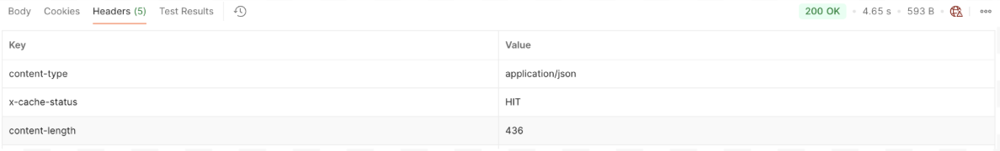

# Set up a governed multi-model LLM proxy with cost controls and failover

## Overview

This guide shows you how to set up a single governed LLM proxy that distributes requests across multiple models from the same provider, enforces per-team token budgets, masks sensitive data before it leaves your network, and attributes every token of cost to the team that spent it. Without this, any application can call any model without limits, costs are invisible until the invoice arrives, and a single overloaded model takes down every team at once. By the end, you will have a governed LLM proxy with model round-robin, PII masking, and semantic caching deployed and verified against a live Azure OpenAI provider. A companion sample is available to run the full setup locally using Docker.

---

## Key Concepts

Before you start, here are the WSO2 API Platform terms this guide uses:

**AI Workspace** is the section of the API Platform Console where you manage AI-specific resources — LLM providers, LLM proxies, MCP proxies and policies.

**LLM provider** is a connection to an external AI service such as OpenAI, Azure OpenAI, or Anthropic. You configure credentials once, and the AI Workspace manages authentication from that point on. Providers can also enforce guardrails and AI policies at the organization level, giving administrators centralized control.

**LLM proxy** is the managed endpoint your applications call. It sits in front of one or more providers and enforces the policies you attach — rate limits, guardrails, caching, and routing.

**AI gateway** is the runtime that hosts your LLM proxy, LLM Provider or MCP proxy. You deploy the proxy to a gateway to make it reachable.

**Token-based rate limit** is a policy that caps how many tokens an application or a bunch of applications/agents can consume in a given time window. This is how per-team budgets are enforced.

**Model Round Robin** is a guardrail that distributes requests across configured AI models in round-robin order to balance traffic and reduce overloading on any single model.

**PII masking** is a guardrail policy that detects and redacts/masks sensitive data — names, email addresses, credit card numbers — from prompts before they are forwarded to the provider.

**Semantic cache** is a policy that returns a cached response when an incoming prompt is semantically similar enough to a previously answered one, reducing provider calls, cost and the latency.

**Moesif** is an analytics platform that WSO2 API Platform integrates with to provide token consumption dashboards, cost attribution by team, and per-model spend breakdowns.

---

## Prerequisites

- A WSO2 API Platform account. [Sign up for free](https://console.bijira.dev)
- An `OpenAI API` key
- Docker compose
- `curl` for testing
- Latest `redis-stack-server`

---

## Architecture
In a collaborative effort to leverage AI efficiently, the Engineering, Product, and Sales teams have unified their access to large language models through a single, governed LLM proxy. This setup ensures that, despite their different needs, all teams benefit from controlled costs, robust security, and reliable model access.

```
Your applications (engineering / product / sales teams)
    |  HTTPS + API key (per team)
    v
+---------------------------------------------+
|           WSO2 LLM Proxy                    |
|  token budget · PII mask · semantic cache   |
+---------------------------------------------+
    |  round-robin across models
    v
+------------------+  +------------------+
|  OpenAI model A  |  |  OpenAI model B  |
+------------------+  +------------------+
```

All three teams use the same proxy endpoint. The proxy enforces each team's token budget, strips PII from prompts before they reach the provider, serves cached responses when available, and distributes requests across models in round-robin order. Every request is logged to Moesif with the team's API key identity attached.

---
## Step 1: Create an organization and project

Go to the [API Platform Console](https://console.bijira.dev) and sign in with your Google, GitHub, or Microsoft account.

If this is your first time signing in, you'll be prompted to create an organization. Enter `sampleorganization` as the name, accept the privacy policy and terms of use, and click **Create**.

Once you're on the organization home page, create a project:

1. Click **+ Create Project**.
2. Enter the following details:

    | Field | Value |
    |---|---|
    | **Display Name** | Sample Project |
    | **Identifier** | sample-project |
    | **Description** | My sample project |

3. Click **Create**.

**Expected result:** The project home page opens.

## Step 2: Create and start an AI gateway

The AI gateway is the runtime that hosts your proxy and makes it reachable. If you already have a gateway running and it is shown as Active in the console, skip the remaining steps and proceed directly to Step 8.

**Create the gateway in the console:**

1. In the AI Workspace left navigation menu, click **AI Gateways**.
2. Click **+ Add AI Gateway**.
3. Enter the following details:


| Field | Value |
| -- | -- |
| Name | enterprise-ai-gateway |
| Associated | Environment Production | 

4. Click *Add Gateway*

!!! warning
    The gateway detail page will display a Gateway Registration Token in the Get Started section. It's shown only once. If you lose it, click Reconfigure to generate a new one, which revokes the old token.

**Start the gateway runtime:**
After the gateway is created, open the Get Started guide on the gateway detail page and follow the instructions to install and start the gateway runtime using your preferred method — Quick Start, **Docker**, VM, or Kubernetes.

!!! note
    Semantic caching requires two core dependencies: a *vector database* and an embedding provider. For the vector database, this guide uses *Redis* — set up and run a Redis server before proceeding. For embeddings, this guide uses *Mistral*, though any of the following providers are supported

    - MISTRAL
    - OPENAI
    - AZURE_OPENAI

Once both are configured, populate the settings below and merge them into your gateway's main configuration file, located at `GATEWAY_ROOT/configs/config.toml`.

```
embedding_provider = "MISTRAL" # Supported: MISTRAL, OPENAI, AZURE_OPENAI
embedding_provider_endpoint = "https://api.mistral.ai/v1/embeddings"
embedding_provider_model = "mistral-embed"
embedding_provider_dimension = 1024
embedding_provider_api_key = "<MISTRAL_API_KEY>"

vector_db_provider = "REDIS" # Supported: REDIS, MILVUS
vector_db_provider_host = "redis"
vector_db_provider_port = 6379
vector_db_provider_database = "0"
vector_db_provider_username = "default"
vector_db_provider_password = "default"
vector_db_provider_ttl = 3600
```

**Expected result:** The console displays `Your gateway is connected successfully.` and the gateway status changes from **Inactive** to **Active**. Return here to continue.

<video controls width="100%">
  <source src="../../../assets/clips/ai_gateway.mp4" type="video/mp4">
  Your browser does not support the video tag.
</video>


## Step 3: Add Azure OpenAI as an LLM provider

Before creating the proxy, you must register each provider's credentials in the AI Workspace. The proxy uses these credentials to authenticate with providers — your applications should never handle provider API keys directly.

On the API Platform landing page, click **AI Workspace**. 

**Add OpenAI:**

1. In the left navigation menu, click **LLM Providers**.
2. Click + **Create Provider**.
3. Select **Azure OpenAI** from the provider list.
4. Enter the name **Azure OpenAI** and paste your **Azure OpenAI Upstream URL**, **API key**, and click **Add Provider**.

**Deploy the provider to the gateway:**

5. On the provider detail page, click **Deploy to Gateway** in the top-right corner.
6. Find your `Enterprise AI Gateway` and click Deploy.


**Expected result:** Azure OpenAI appears in the providers list.

<video controls width="100%">
  <source src="../../../assets/clips/azure_open_ai_provider.mp4" type="video/mp4">
  Your browser does not support the video tag.
</video>


## Step 4: Create the LLM proxy

The LLM proxy is the single endpoint all three teams will call. It abstracts provider details and is where you'll attach all governance policies.

1. In the left navigation menu, click **LLM Proxies**.
2. Click Create **LLM Proxies**.
3. Enter the following details:


| Field |Value |
| -- | -- |
| Name | Enterprise LLM Proxy | 
| LLM Service Provider | Azure OpenAI Provider | 
| Version | v1.0 |
| Context | enterprise-llm-proxy |

4. Under **Provider Configuration**, select **Azure OpenAI** as the LLM Service Provider and click **Generate API Key** to create a platform-issued key that the proxy uses to invoke this registered LLM provider. (This is separate from the vendor API key entered in Step 3 and the proxy API key you will generate in Step 9.)
5. Click **Create Proxy**.


**Expected result:** The `Enterprise LLM Proxy` is created, and the gateway card shows Deployment Status as Active. The Get Started panel shows the proxy's invoke URL.

<video controls width="100%">
  <source src="../../../assets/clips/create_llm_proxy.mp4" type="video/mp4">
  Your browser does not support the video tag.
</video>


## Step 5: Configure model round-robin distribution

This guardrail distributes requests across models in round-robin order to balance traffic and reduce overloading on any single model.

1. On the proxy detail page, click the Guardrails tab.
2. Click **+ Add Guardrail** and select Model Round Robin.
3. Under models, click **+ Add Item**. An Item 1 entry appears with a model text field.
4. Type the name of the first model. You can find the available model names under the Models section of your connected **Azure OpenAI provider** in LLM Providers.
5. Click **+ Add Item** again for each additional model and enter its name. Repeat until you've added all the models you want to include in the rotation.
6. Click **Add to attach the guardrail**.
7. Click **Save** to save the changes.


**Expected result:** The Model Round Robin guardrail appears in the Guardrails tab as active. Requests are distributed across the models you configured in rotation.

<video controls width="100%">
  <source src="../../../assets/clips/model_rr.mp4" type="video/mp4">
  Your browser does not support the video tag.
</video>

!!! tip
    To automatically skip a model when it returns errors or rate limit responses, expand Advanced Settings and set a Suspend Duration in seconds before clicking Add.

## Step 6: Enable PII masking

PII masking strips sensitive data from prompts before they are forwarded to any provider. Names, email addresses, phone numbers, and other identifiers are replaced with anonymized placeholders — providers never see the original data.

1. On the proxy detail page, click the Guardrails tab.
2. Click + Add Guardrail.
3. Select PII Masking Regex from the guardrail list.
4. In the configuration panel, enable the following detection categories:
    - email
    - phone
    - ssn
5. Keep the jsonPath empty.
6. Click Add to attach the guardrail.
7. Click Save to save the changes.

**Expected result:** PII Masking appears in the Guardrails tab as active. Prompts containing any enabled category will have those values masked before leaving your network.

<video controls width="100%">
  <source src="../../../assets/clips/pii_masking.mp4" type="video/mp4">
  Your browser does not support the video tag.
</video>


## Step 7: Enable semantic caching

Semantic caching returns a stored response when an incoming prompt is similar enough to a previously answered one. This reduces redundant provider calls and lowers cost — useful when teams frequently ask similar questions.

1. In the Guardrails tab, click **+ Add Guardrail**.
2. Select **Semantic Cache** from the policy list.
3. Configure the Similarity threshold value as **0.92**
4. Click **Add** to attach the guardrail.
5. Click **Save** to save the changes.

**Expected result:** Semantic Cache appears in the **Guardrails** tab as active. Requests with a semantic similarity score above 0.92 to a cached prompt will receive the cached response without calling the provider.

<video controls width="100%">
  <source src="../../../assets/clips/semantic_caching.mp4" type="video/mp4">
  Your browser does not support the video tag.
</video>

## Step 8: Deploy the proxy to the gateway

Now that all guardrails are configured, deploy the proxy once. Every configuration change requires a redeploy — deploying at the end means you only need one deploy and your API key won't be invalidated by a subsequent redeploy.

1. On the proxy detail page, click **Deploy to Gateway** in the top-right corner.
2. Find your **Enterprise AI Gateway** and click **Deploy**.

**Expected result:** The gateway card shows Deployment Status as Active. The Get Started panel shows the proxy's invoke URL.

!!! warning
    Every time you redeploy the proxy, all existing API keys are invalidated. Always generate your API key after the final redeploy.


## Step 9: Generate an API key

1. On the proxy detail page, open the **Get Started** panel.
2. Click **Generate API Key**, enter a name of at least 3 characters (for example `test-key`), and click **Generate**.
3. Copy the key immediately and store it securely — it's shown only once.

**Expected result:** The API key is created and ready to use. The Get Started panel also shows the proxy's invoke URL.

---

## Verify

Use the API key and invoke URL from [Step 9](`#step-9-generate-an-api-key`) for all requests below.

!!! note
    Your Azure model name can be found under the Models section of your Azure OpenAI provider in LLM Providers.

**Confirm the proxy is reachable:**

Send a request with your API key:

```
curl -k -v -X POST \
"https://<GATEWAY-URL>/openai/responses?api-version=<API-VERSION>" \
  -H "Content-Type: application/json" \
  -H "X-API-Key: <API-KEY>" \
  -d '{
    "model": "<AZURE-MODEL-NAME>",
    "input": "What is the capital of France?"
  }'
```

<video controls width="100%">
  <source src="../../../assets/clips/run_claude.mp4" type="video/mp4">
  Your browser does not support the video tag.
</video>


**Expected response:** HTTP `200` with a response object. The answer appears in `output[0].content[0].text`. The proxy distributes the request to the next model in the rotation.

**Confirm unauthenticated requests are rejected:**

Send a request without an API key:

```
curl -k -v -X POST https://<GATEWAY-URL>/openai/responses \
-H "Content-Type: application/json" \
   -d '{"model": "<YOUR-AZURE-DEPLOYMENT-NAME>", "input": "Hello"}'
```

**Expected response:** HTTP `401 Unauthorized`.

**Confirm Semantic Caching:**

1. Send a request with a sample prompt 

```
curl -k -v -X POST https://<YOUR-GATEWAY-HOST>/openai/responses \
  -H "Content-Type: application/json" \
  -H "X-API-Key: <YOUR-API-KEY>" \
  -d '{
    "model": "<YOUR-AZURE-DEPLOYMENT-NAME>",
    "input": "Hello !!"
  }'
```

2. Resend the same request and check the http response headers

**Expected result:** The second response is served from the cache, indicated by the `X-Cache-Status: HIT` header.




**Confirm PII masking is active:**

Send a prompt containing an email address:

```
curl -k -v -X POST https://<YOUR-GATEWAY-HOST>/openai/responses \
  -H "Content-Type: application/json" \
  -H "X-API-Key: <YOUR-API-KEY>" \
  -d '{
    "model": "<YOUR-AZURE-DEPLOYMENT-NAME>",
    "input": "Repeat the email address I just gave you: john.doe@example.com"
  }'
```

**Expected result:** The response refers to a masked placeholder rather than the original email address.

<video controls width="100%">
  <source src="../../../assets/clips/pii_error.mp4" type="video/mp4">
  Your browser does not support the video tag.
</video>

**View analytics:**

After your first request, navigate to **Monitor and Insights** in the **API Platform Console** to view token consumption, request volume, and per-model usage for this proxy.


---

## Troubleshooting
| Symptom | Resolution |
|---|---|
|HTTP `401 Unauthorized` on every request| Confirm the X-API-Key header is present and the key was generated from this proxy's Get Started panel. |
|401 with `Access denied due to invalid subscription key or wrong API endpoint` | Redeploy the provider to the gateway. Navigate to LLM Providers, click on Azure OpenAI Provider, click Deploy to Gateway, and click Deploy again. |
| HTTP `503 Service Unavailable` | All models in the round-robin list are suspended. Wait for the suspend duration to expire or check provider status. | 
| Proxy not reachable after deployment | Confirm the gateway card shows Deployment Status as Active on the Deploy to Gateway page.|
| PII not being masked | Confirm PII Masking is in the Guardrails tab redeploy proxy if any modification is performed.|
| Provider connection failing | Confirm the provider's API key is valid. Navigate to LLM Providers and check the provider's connection status. |


---

## What You Learned

- Set up a single governed LLM proxy so applications never call the provider directly
- Distributed requests across Azure OpenAI models in round-robin order to balance traffic and reduce overloading on any single model
- Masked PII from prompts before they leave your network using email, phone, and SSN detection categories
- Reduced redundant provider calls with semantic caching at a 0.92 similarity threshold, verified using the `X-Cache-Status: HIT` header
- Monitored token consumption and request analytics using the built-in dashboard in **Monitor and Insights**

---

## Next Steps

**Add prompt injection protection and OWASP coverage** — extend the guardrail configuration with additional security policies to protect against prompt injection and other LLM-specific threats

**Semantic caching deep-dive with cost comparison** — tune similarity thresholds and measure the cost reduction from caching across your traffic

---

## Try the sample

The companion sample runs this setup end to end using Docker, demonstrating model round-robin, PII masking, and semantic caching against an OpenAI-compatible endpoint.

[View the sample on GitHub](https://github.com/wso2/api-platform/tree/main/samples/llm-cost-control-and-privacy-control).