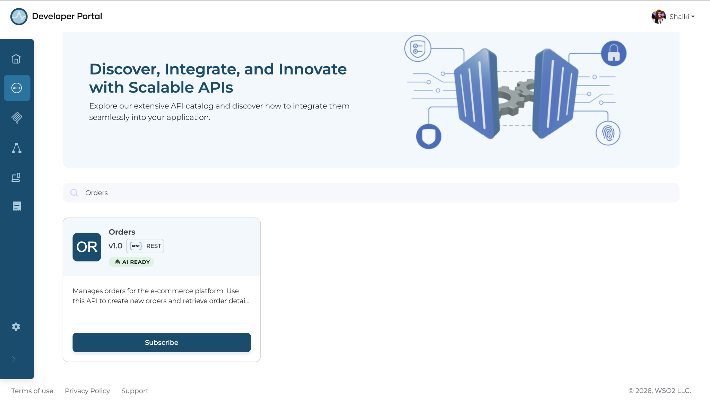
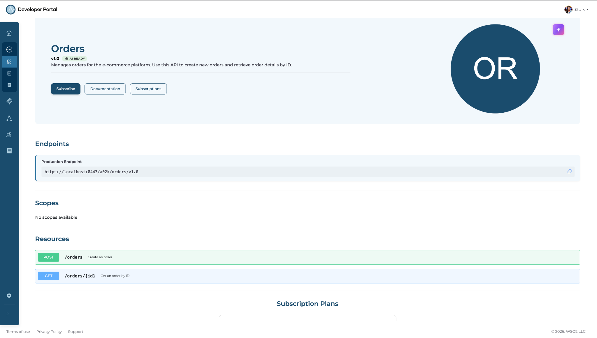
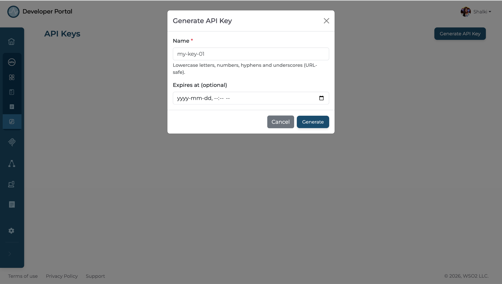
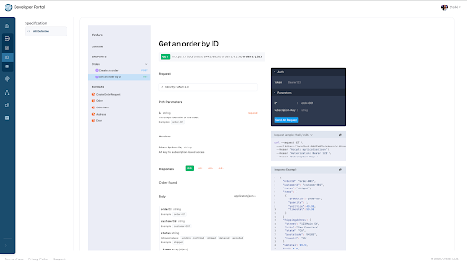
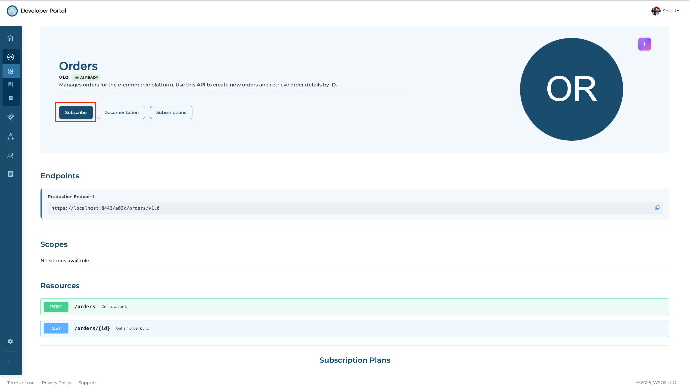
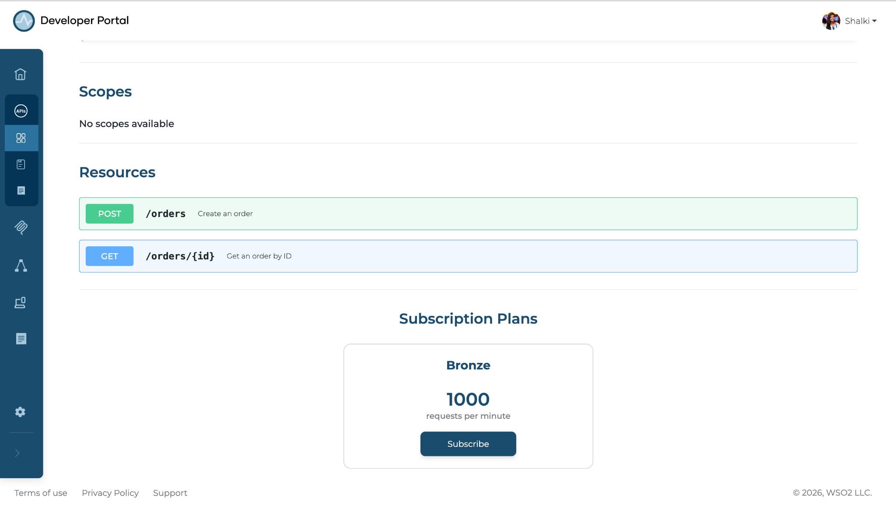
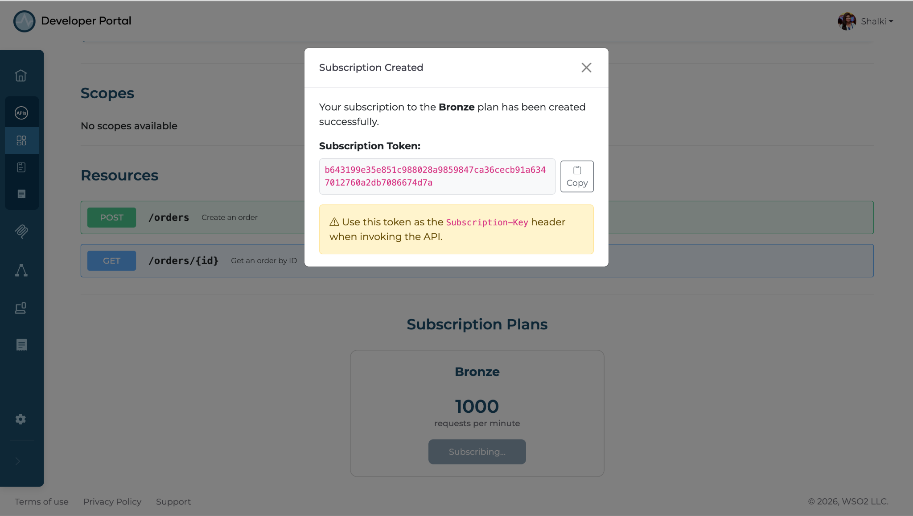

# Go from zero to a working API call using the Developer Portal

## Overview

This guide shows you how to discover an API, try it using an API key before subscribing, and then subscribe to a plan to apply rate limits. API requests are authenticated using the API key, while the subscription token enables the rate limits associated with your selected plan. By the end, you'll have authenticated and rate-limited access to two APIs using credentials you generated yourself.

In this guide, you will walk through a scenario where a developer new to a team needs to find and use the Orders API and Customer API to build a checkout feature. Instead of relying on support tickets or manual coordination, they use the Developer Portal to discover APIs, test them, subscribe to plans, and make their first authenticated and rate-limited API calls through a self-service experience.

## Learning objectives

- Discover and evaluate APIs in the Developer Portal catalog.
- Try an API endpoint using an API key to validate the response before subscribing.
- Subscribe to a plan and generate a subscription token through the Developer Portal to enable rate limits.
- Invoke APIs using both the API key for authentication and the subscription token to confirm rate limiting is applied.

## Prerequisites

- A WSO2 API Platform account. [Sign up for free](https://wso2.com/api-platform/).
- `curl` or Postman for testing.

## Architecture

```
          [Developer — new to the team]
               |                    |
  browses catalog                   |  first API call
  gets API key / subscription token |  with credentials
  subscribes to APIs                |
               |                    |
               v                    v
+-------------------------+   +---------------------------------------------+
|  WSO2 DEVELOPER PORTAL  |   |  WSO2 API GATEWAY                           |
|     catalog · docs      |   |  API key · subscription token · rate limit  |
|                         |   |                                             |
+-------------------------+   +---------------------------------------------+
                                      |
                                      |  authenticated request
                                      v
                              [Orders API backend]
```

The diagram shows how a new developer uses the WSO2 Developer Portal to discover APIs, obtain credentials, and subscribe to APIs, then makes authenticated and rate-limited API calls through the WSO2 API Gateway to the backend services.

## Step 1: Navigate to the Developer Portal and search for the Orders API

The API catalog lists all APIs published to your organization. Searching by name is the fastest way to find an API.

Navigate to your organization's Developer Portal. In the search bar, type `Orders` and press **Enter**.

**Expected result:** The search returns the Orders API. Click **Orders API** to open it.

{.cInlineImage-full}

## Step 2: Review the API overview and available endpoints

Reviewing the overview and available operations confirms the API provides the functionality your checkout service needs.

On the Orders API page, read the **Overview** section. Then scroll down to the **Resources** section and review the available operations.

**Expected result:** The **Resources** tab lists the `POST /orders` and `GET /orders/{id}` operations.

{.cInlineImage-full}

## Step 3: Create an API key for the Orders API

An API key lets you try the API directly from the Developer Portal before committing to a subscription tier.

Navigate to the **API Keys** tab and click **Generate API Key**.

**Expected result:** The portal generates and displays an API key. Copy it — you'll use it in the next step.

!!! note
    The API Key policy must be applied by the publisher to the Orders API for the **API Key** button to be enabled.

{.cInlineImage-full}

## Step 4: Run a test request using the API key

The **Documentation** tab lets you send a live request to the production endpoint and confirm the response matches what your checkout service expects.

On the Orders API page, navigate to the **Documentation** tab and open the **Endpoints** section. Select `GET /orders/{id}` from the endpoint list. In the **Auth** section, paste the API key from Step 3. In the `id` field, enter `order-001`. Copy the generated curl command and run it in a terminal or Postman.

**Expected result:** You receive a response containing order data. Confirm the response fields match what your checkout service needs.

{.cInlineImage-full}

## Step 5: Create a subscription to the Orders API

Now that you've confirmed the API meets your needs, subscribe to it on the Bronze tier to apply rate limits.

On the Orders API's **Overview** page, click **Subscribe**.

{.cInlineImage-full}

In the subscription plans section, select the **Bronze** card and click **Subscribe**.

{.cInlineImage-full}

**Expected result:** Copy the subscription token and save it securely. You will need it in the following steps.

!!! note
    The **Subscribe** button appears only when the API publisher has applied a subscription policy and enabled at least one subscription plan for the API.

{.cInlineImage-full}

## Step 6: Run an authenticated request with rate limiting applied to the Orders API

Navigate to the **Documentation** tab on the Orders API page and open the **Endpoints** section.

Select `GET /orders/{id}` from the endpoint list. In the **Auth** section, paste both the API key obtained in Step 3 and the subscription token from Step 5. In the `id` field, enter `order-001`.

Copy the generated curl command and run it in a terminal or Postman. Now you have executed an authenticated request with rate limiting applied.

**Expected result:** You receive HTTP 200 with a response containing order data.

## Step 7: Navigate to the Customer API

Navigate to the **APIs** tab. In the search bar, type `customer` and press **Enter**. Click **Customer API** to open it.

**Expected result:** The Customer API Overview page opens.

## Step 8: Create an API key for the Customer API

Follow the same steps described in [Step 3](#step-3-create-an-api-key-for-the-orders-api) to generate an API key for the Customer API. Copy and securely save the generated API key.

!!! note
    The API Key policy must be applied by the publisher to the Customer API for the **API Key** button to be enabled.

**Expected result:** The API key is generated and displayed in the UI.

## Step 9: Create a subscription to the Customer API

Subscribe to the Customer API by following the same steps as in [Step 5](#step-5-create-a-subscription-to-the-orders-api). Copy and securely save the generated subscription token.

**Expected result:** The subscription token is generated and displayed in the UI.

## Step 10: Run an authenticated request with rate limiting applied to the Customer API

Navigate to the **Documentation** tab on the Customer API page and open the **Endpoints** section. Select `GET /customers/{id}` from the endpoint list. In the **Auth** section, paste the API key from Step 8 and the subscription token from Step 9. In the `id` field, enter `customer-001`. Copy the generated cURL command and run it in a terminal or Postman.

**Expected result:** You receive HTTP 200 with a response containing customer data.

## Verify

- Send a `GET /orders/{id}` request without an API key header. Confirm you receive HTTP 401.
- Send a `GET /orders/{id}` request with the API key from Step 3 and subscription token from Step 5. Confirm you receive HTTP 200 with order data.
- Send a `GET /customers/{id}` request with the API key from Step 8 and subscription token from Step 9. Confirm you receive HTTP 200 with customer data.

## Troubleshooting

| Symptom | Resolution |
|---------|------------|
| HTTP 401 Unauthorized on every request | Confirm you're passing the correct key in the request header. Regenerate the key and retry. |
| HTTP 403 Forbidden | Check whether a subscription is available if you are using a subscription token for authentication. |
| HTTP 429 Too Many Requests | You've exceeded the Bronze tier limit of 1,000 requests per hour. Wait for the quota window to reset or upgrade to a higher tier. |
| Subscribe button is not available | Confirm the API publisher has applied a subscription policy and enabled at least one subscription plan for the API. |
| API Keys tab is not available | Confirm the API publisher has applied an API Key policy to the API. |

## What you learned

- Discovered and evaluated APIs in the Developer Portal catalog using search.
- Used the **Documentation** tab to validate API responses with an API key before subscribing to a plan.
- Generated subscription tokens through the Developer Portal without raising a support ticket.
- Subscribed to APIs and invoked them using an API key for authentication and a subscription token to enforce rate limits.

## Next steps

- **Upgrade to a metered subscription plan** — move from the Bronze to a usage-based plan for production workloads.
- **Add documentation for the API** — publish and maintain API documentation (such as guides, examples, and OpenAPI specifications) in the Developer Portal to help consumers understand and use the API effectively.
- **AI agent discovery** — publish your APIs so AI agents can discover and call them through the Developer Portal.