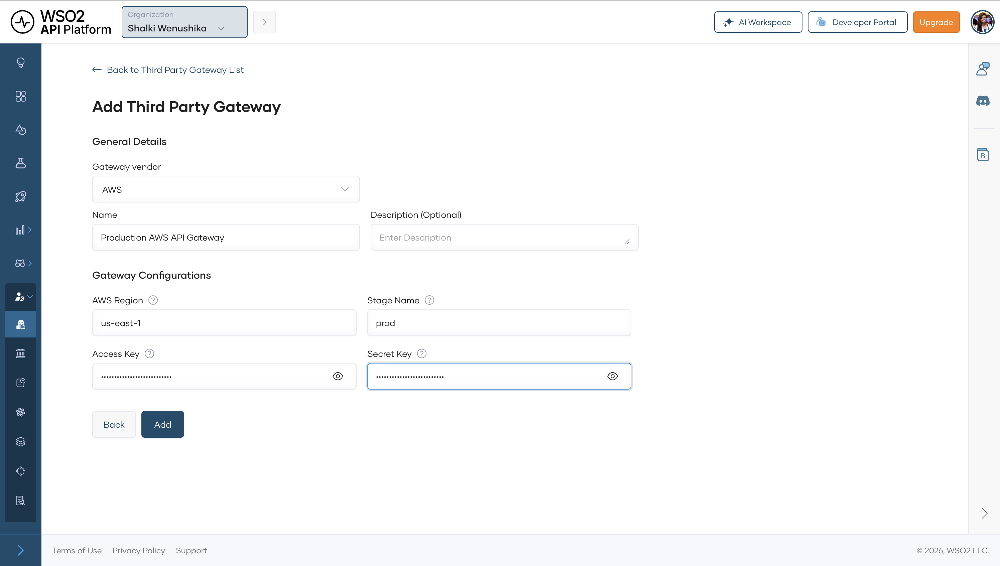
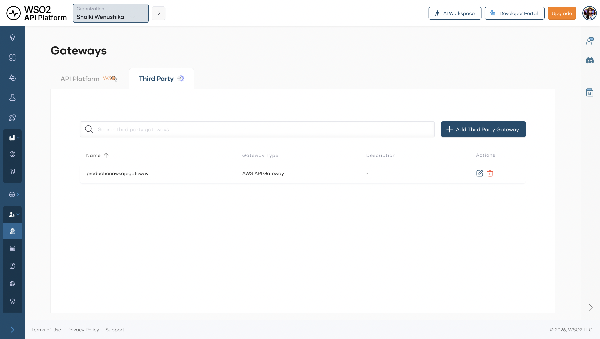
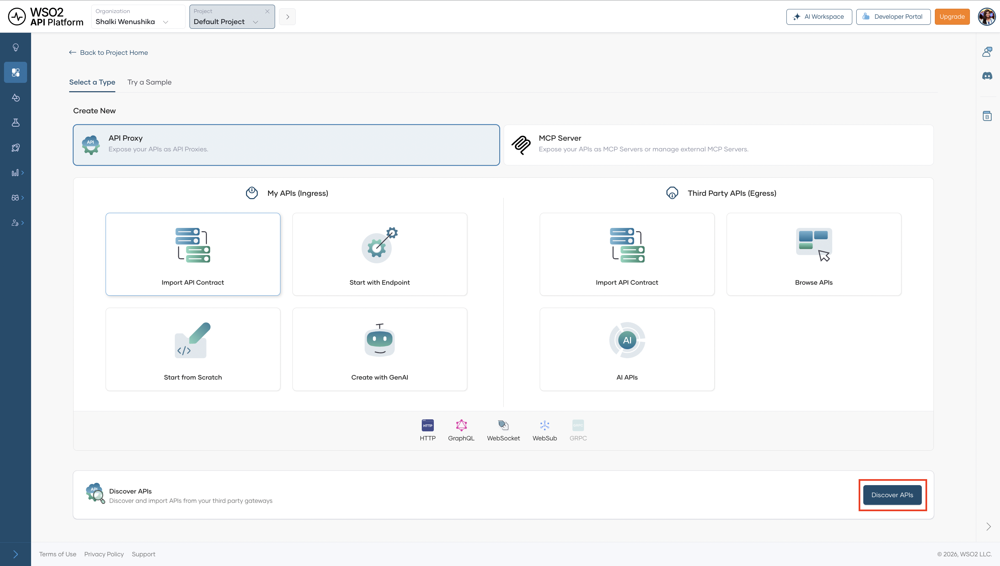
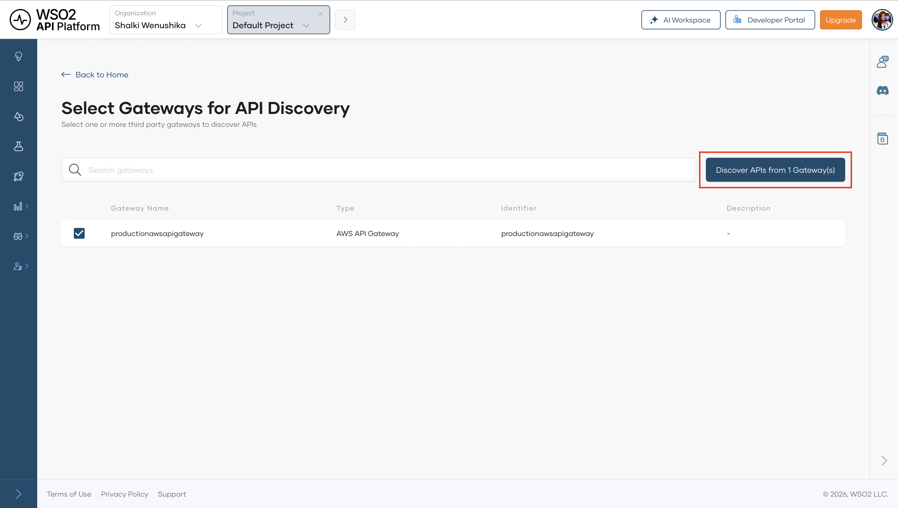
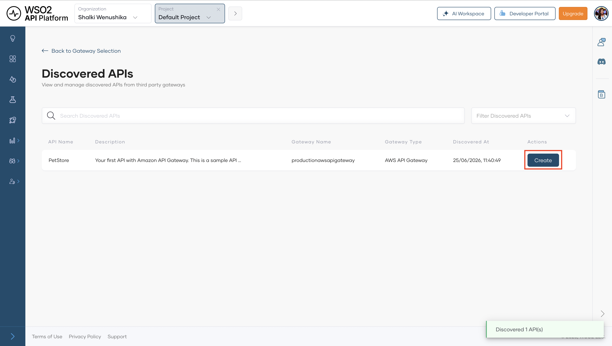
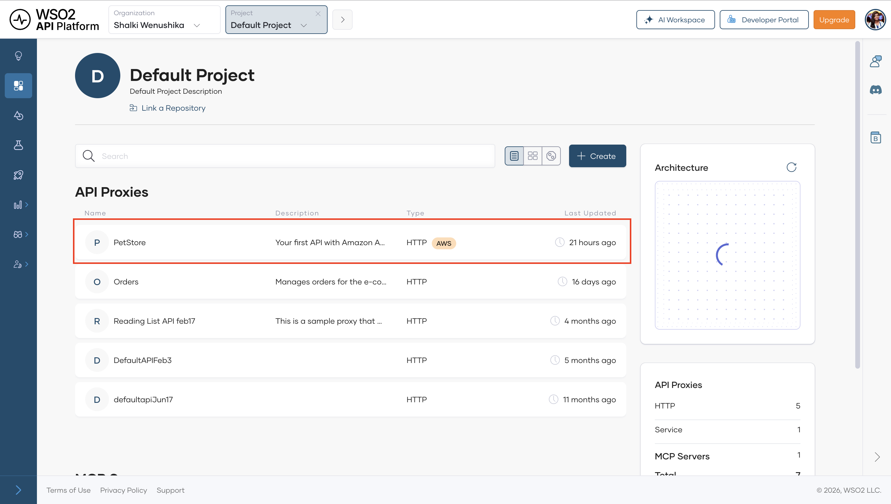
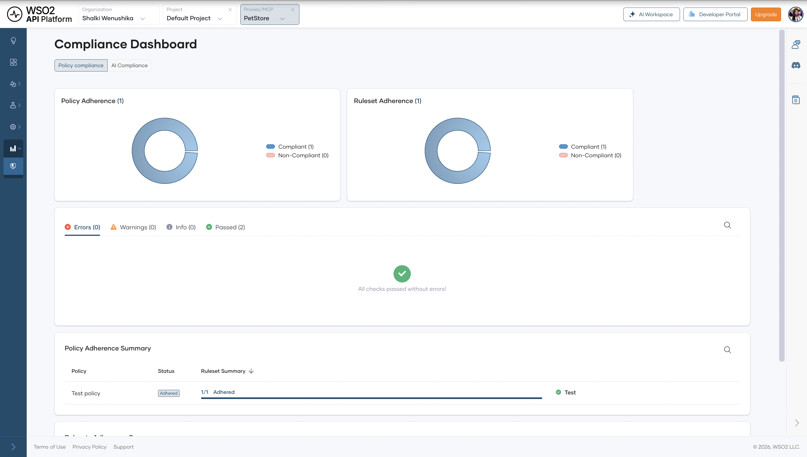
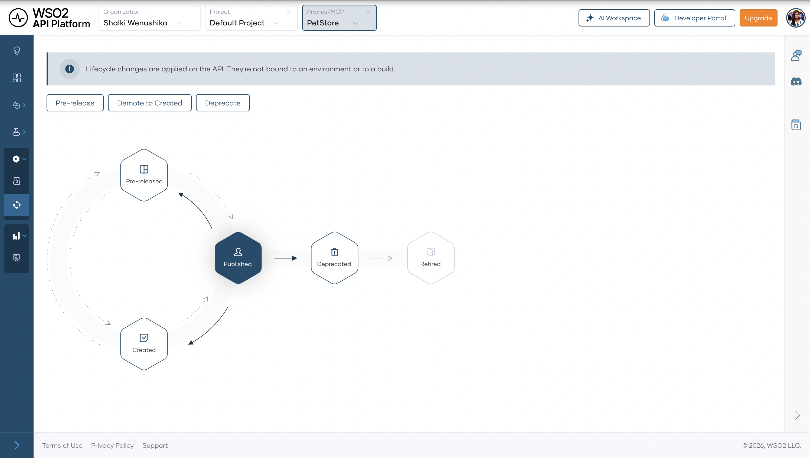

# Discover APIs from AWS API Gateway

## Overview

This guide shows you how to discover APIs from AWS API Gateway and bring them under centralized governance. Connecting a third party gateway to WSO2 API Platform lets API Platform discover its APIs, apply policies, and surface them in the Developer Portal, all without rerouting any traffic. By the end, you'll have AWS API Gateway connected as a third party gateway, with its APIs discovered and visible in your project.

---

## Prerequisites

- An active AWS account with access to AWS API Gateway.
- Permissions in AWS to create IAM users and generate access keys.
- Admin access to your WSO2 API Platform organization.

---

## Architecture

```
+-----------------------------------------------+
|  AWS Console                                  |
|  1. Create REST API and deploy to stage       |
|  2. Create IAM user → access key + secret key |
+-----------------------------------------------+
          |
          | REST API deployed
          |
          v
+---------------------+                                  +------------------------------------------+
|  AWS API Gateway    |  connects to AWS API Gateway     |  WSO2 API Platform                       |
|                     |  using IAM credentials           |                                          |
|  REST APIs          |<---------------------------------|  3. Add Third Party Gateway              |
|  Stage: prod        |                                  |     name · region · stage · credentials  |
|                     |                                  |                                          |
|  all API traffic    |<---------------------------------|  4. Discover REST APIs                   |
|  stays here         |--- REST API metadata ----------->|     from configured stage                |
+---------------------+                                  |                                          |
          ^                                              |  5. Check compliance dashboard           |
          |                                              |                                          |
          |                                              |                                          |
          |                                              +------------------------------------------+
          |                                                                 | 6. Publish to Developer Portal
          |                                                                 v
          |                                              +------------------------------------------+
          |                                              |  Developer Portal                        |
          |                                              |  catalog · subscriptions                 |
          |                                              +------------------------------------------+
          |                                                                  ^
          |   API calls go directly to AWS                                   | developer discovers
          |   (not proxied through platform)                                 | and subscribes
          +-----------------------------------[Developer]--------------------+
```

WSO2 API Platform discovers REST APIs from AWS API Gateway using the IAM credentials you configure. No traffic is rerouted. API calls from developers continue to go directly to AWS API Gateway. API Platform holds a reference to each discovered API and makes it visible in the API Platform console.

---

## Step 1: Create and deploy a REST API in AWS API Gateway

Skip this step if you already have a REST API deployed to a stage in AWS API Gateway.

This step creates an example REST API and deploys it so that API Platform has something to discover.

### 1.1 Create the REST API

1. Sign in to the [AWS Console](https://console.aws.amazon.com) and navigate to **API Gateway**.
2. Click **Create API**.
3. Under **Choose an API type**, select **REST API** and click **Build**.
4. Under **API Details** click **Example API**.
5. Under **API endpoint type** select Regional.
6. Click **Create API**.

**Expected result:** AWS API Gateway opens the **Resources** editor for your new API.

### 1.2 Create a stage

A **stage** is a named deployment snapshot in AWS API Gateway (for example, `prod` or `dev`). API Platform discovers APIs from a specific stage, so you must create one before deploying.

1. In the left navigation menu, click **Stages**.
2. Click **Create stage**.
3. Fill in the stage details:

    | Field | Value            |
    |---|------------------|
    | **Stage name** | `prod`           |
    | **Stage description** | Production stage |

4. Click **Create stage**.

**Expected result:** The `prod` stage appears in the Stages list.

### 1.3 Deploy the API to the stage

1. In the left navigation menu, click **Resources**. 
2. Click **Deploy API**.
3. In the **Deploy API** dialog:

    | Field | Value              |
    |---|--------------------|
    | **Deployment stage** | `prod`             |
    | **Deployment description** | Initial deployment |

4. Click **Deploy**.

**Expected result:** AWS API Gateway displays the **Stage Editor** for the `prod` stage.

---

## Step 2: Configure IAM credentials in AWS

API Platform connects to AWS API Gateway using an **IAM user's** (AWS Identity and Access Management) access key and secret key. Creating a dedicated IAM user with scoped permissions is safer than using root credentials or reusing an existing user's keys.

!!! warning
    Don't use your AWS root account credentials. They give unrestricted access to your entire AWS account. Create a dedicated IAM user as shown below. When you generate the access key in step 2.2, the secret access key is shown only once; copy it immediately and store it securely. For AWS credential best practices, see [Best practices for managing AWS access keys](https://docs.aws.amazon.com/IAM/latest/UserGuide/id_credentials_access-keys.html#securing_access-keys).

### 2.1 Create an IAM user

1. In the AWS Console, search for **IAM** and open the IAM service.
2. In the left navigation menu, under **Access Management**, click **Users**.
3. Click **Create user**.
4. Enter a user name (for example, `api-platform-discovery`) and click **Next**.
5. On the **Set permissions** page, select **Attach policies directly**.
6. Search for `AmazonAPIGatewayAdministrator` and check the box next to it.
7. Click **Next**, review the details, and click **Create user**.

**Expected result:** The new IAM user appears in the Users list.

### 2.2 Generate an access key

1. Click the IAM user you just created to open the user details page.
2. Click the **Security credentials** tab.
3. Under **Access keys**, click **Create access key**.
4. On the **Access key best practices & alternatives** page, select **Third-party service** as the use case and click **Next**.
5. Add an optional description tag (for example, `API Platform discovery key`) and click **Create access key**.
6. Copy both the **Access key** and **Secret access key** and store them securely.

**Expected result:** You have an access key ID and a secret access key ready to enter in API Platform.

---

## Step 3: Add a third party gateway in API Platform

Now that you have AWS credentials, register AWS API Gateway as a Third party gateway in API Platform. This step requires admin access to your organization.

1. Sign in to the API Platform Console.
2. In the top navigation bar, select your organization from the organization switcher.
3. In the left navigation menu, click **Admin**, then click **Gateways**.
4. Select the **Third Party** tab.
5. Click **Add Third Party Gateway**.
6. Fill in the gateway configuration:

    | Field | Value                        | Notes |
    |---|------------------------------|---|
    | **Gateway Name** | `Production AWS API Gateway` | A descriptive name you'll see during discovery |
    | **Region** | `us-east-1`                  | The AWS region where your API Gateway is deployed |
    | **Stage** | `prod`                        | The stage you deployed to in Step 1 |
    | **Access Key** | *(from Step 2.2)*            | The IAM user's access key ID |
    | **Secret Key** | *(from Step 2.2)*            | The IAM user's secret access key |

7. Click **Add**.

    {.cInlineImage-full}

**Expected result:** The external gateway `productionawsapigateway` appears in the Third Party Gateway list. API Platform can now query this gateway during discovery.

{.cInlineImage-full}

---

## Step 4: Discover REST APIs from the gateway

With the third party gateway registered, you can discover the REST APIs it hosts. The APIs continue running on AWS API Gateway. API Platform holds a reference to each one and makes it visible in the API Platform Console. You do this from within a project.

### 4.1 Navigate to discover APIs

1. From the API Platform Console home page, open the project you want to add the discovered APIs to. If you don't have a project yet, click **+ Create Project**, enter a name, and click **Create**.
2. On the project overview page, click **Create**.
3. Click **Discover APIs**.

    {.cInlineImage-full}

**Expected result:** The **Select Gateways for API Discovery** page opens and shows the list of registered third party gateways.

### 4.2 Select gateways and run discovery

1. On the **Select Gateways** page, check the box next to each gateway you want to discover from. Select `productionawsapigateway`.

    You can select multiple gateways in one discovery run. API Platform queries all selected gateways simultaneously and returns a merged list of discovered APIs.

2. Click **Discover APIs from Gateways**.

    {.cInlineImage-full}

**Expected result:** API Platform queries the selected gateways and displays a table of discovered REST APIs.

### 4.3 Add discovered APIs to the project

The discovery results table lists every API found on the selected gateways, along with the gateway name it was discovered from.

1. Review the list of discovered APIs.
2. For each API you want to add to your project, click **Create** next to the API name. API Platform creates a reference to that API in the project.
   {.cInlineImage-full}
3. Repeat for all APIs you want to add.
4. When done, navigate to the project **Overview** page to confirm the APIs appear there.

**Expected result:** Each API you clicked **Create** for is now listed in the project overview.

{.cInlineImage-full}

---

## Step 5: Navigate to the discovered API overview

Each API added from a connected third party gateway has its own overview page in API Platform that shows the gateway metadata captured at discovery time.

1. On the project **Overview** page, click the name of the API you just added (for example, `PetStore`).

**Expected result:** The API overview page opens and shows the endpoint URL, API specification, and gateway metadata captured at discovery time.

### 5.1 Check policy compliance

1. In the left navigation menu, click **Insights**, then click **Compliance**.

**Expected result:** The compliance dashboard opens and shows the policy compliance status for the API.

{.cInlineImage-full}

---

## Step 6: Publish the API to the Developer Portal

Publishing the API makes it discoverable in the Developer Portal so developers can find it, read its documentation, and subscribe to it. Their API invocations go directly to the AWS API Gateway.

1. In the left navigation menu, click **Manage**, then click **Lifecycle**.
2. Click **Publish**.
3. Confirm the display name and click **Confirm**.

**Expected result:** The lifecycle state changes to **Published**. The API is now visible in the Developer Portal. Developers who invoke it send requests directly to the AWS API Gateway.

{.cInlineImage-full}

---

## Verify

1. Confirm the discovered API appears in the project overview. Navigate to your project and confirm the API is listed with its gateway name and region.
2. Confirm endpoints are listed. On the API overview page, confirm the endpoint URL and API specification are correctly reflected.
3. Navigate to **Admin > Gateways > Third Party** and confirm `productionawsapigateway` is listed.
4. Confirm the API is published. Navigate to the Developer Portal and confirm the API appears in the API catalog.
5. Confirm invocations go directly to AWS. Send a request using the production URL from the API overview. Confirm the response comes from AWS API Gateway and not through API Platform.

---

## Troubleshooting

| Symptom                                                               | Resolution                                                                                                                                                                                                                   |
|-----------------------------------------------------------------------|------------------------------------------------------------------------------------------------------------------------------------------------------------------------------------------------------------------------------|
| **Add Third Party Gateway** returns a 500 error                       | The IAM credentials are invalid. Confirm the access key and secret key are copied correctly and belong to the IAM user with the `AmazonAPIGatewayAdministrator` policy attached.                                             |
| No APIs appear after clicking **Discover APIs from Gateways**         | Confirm the region in the gateway configuration matches the AWS region where your APIs are deployed. Check the region in the top-right corner of the AWS Console and update the gateway configuration to match. Also confirm the stage name exactly matches a deployed stage in AWS API Gateway. Stage names are case-sensitive (`dev` ≠ `Dev`). |
| API does not appear in the project overview after clicking **Create** | Refresh the page. If it still does not appear, navigate to the project overview directly. The page may need a manual refresh to show newly added APIs.                                                                        |
| IAM access key creation fails                                         | Your AWS account may have reached the maximum of two access keys per IAM user. Delete an existing unused key from the **Security credentials** tab before creating a new one.                                                |

---

## What you learned

- Created and deployed a REST API in AWS API Gateway and generated scoped IAM credentials for API Platform to use.
- Registered AWS API Gateway as an external gateway in WSO2 API Platform using IAM credentials.
- Ran API discovery to pull REST API metadata from the registered gateway into API Platform.
- Brought REST APIs under governance in API Platform and checked policy compliance using the Compliance dashboard.
- Published the API to the Developer Portal so developers can discover and subscribe to it, while all invocations continue to go directly to AWS API Gateway.

---

## Next steps

- [Gateway federation overview](../../cloud/federation/overview.md) — learn about the full lifecycle of gateway federation in API Platform, including governance and compliance monitoring.
- [Manage the API lifecycle](../../cloud/develop-api-proxy/lifecycle-management.md) — move an API discovered from an external gateway through the lifecycle states to publish it to the Developer Portal.
- [Discover APIs in the Developer Portal](../../cloud/devportal/discover-apis/api-search.md) — understand how consumers find and subscribe to APIs you've published, including those from external gateways.