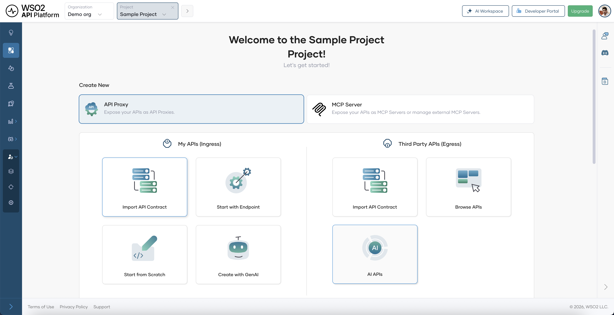
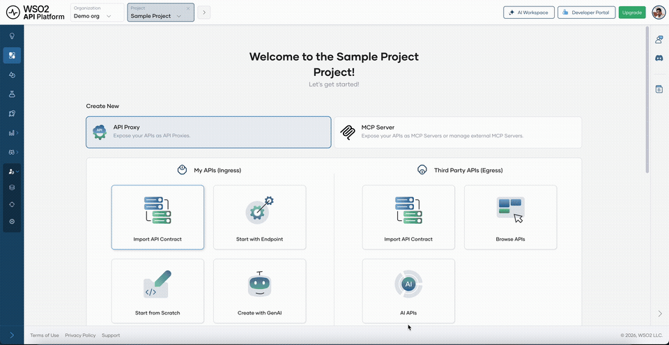
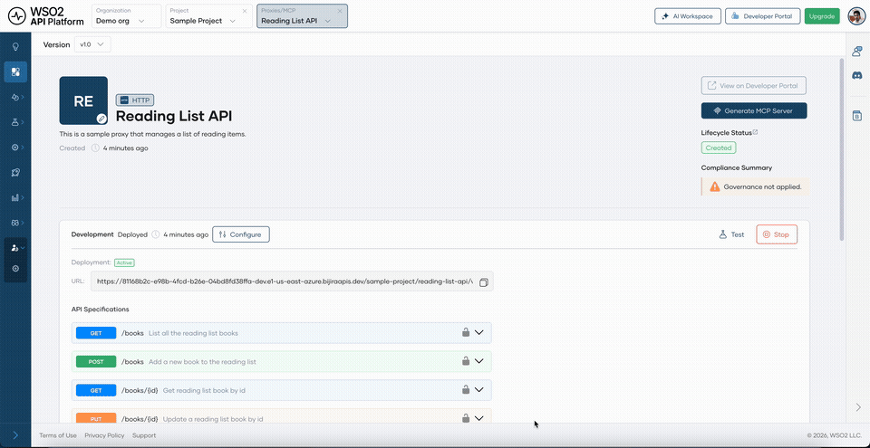
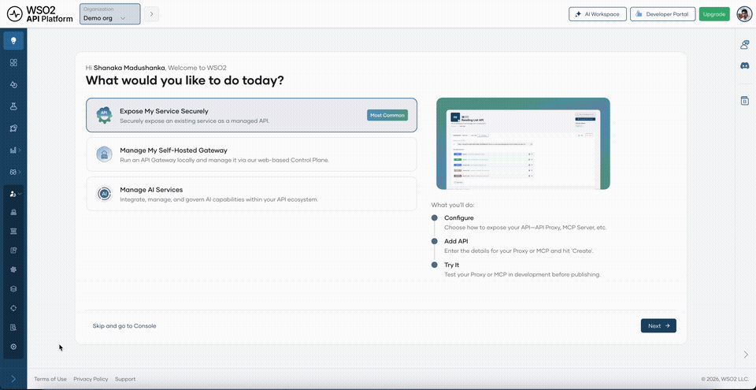
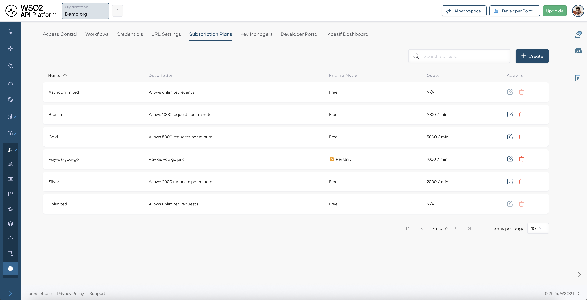
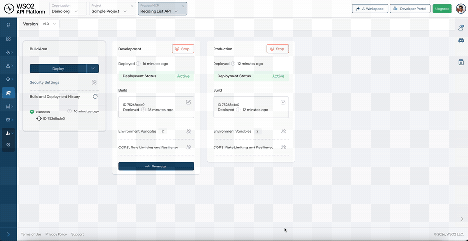
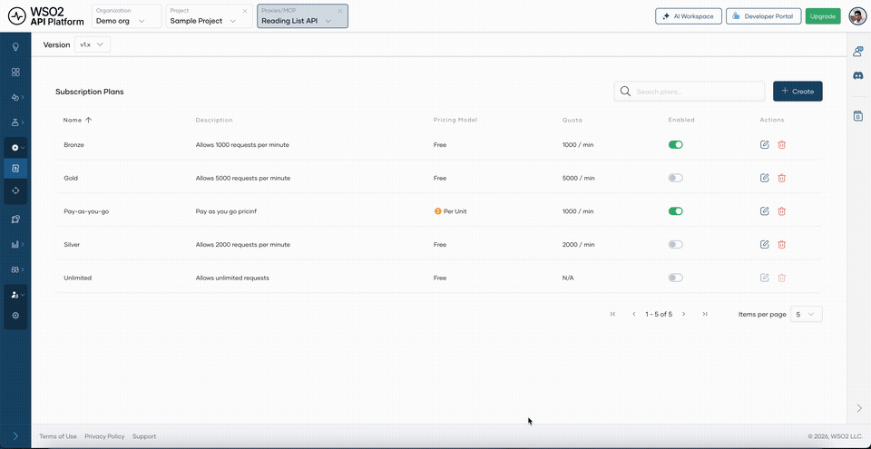
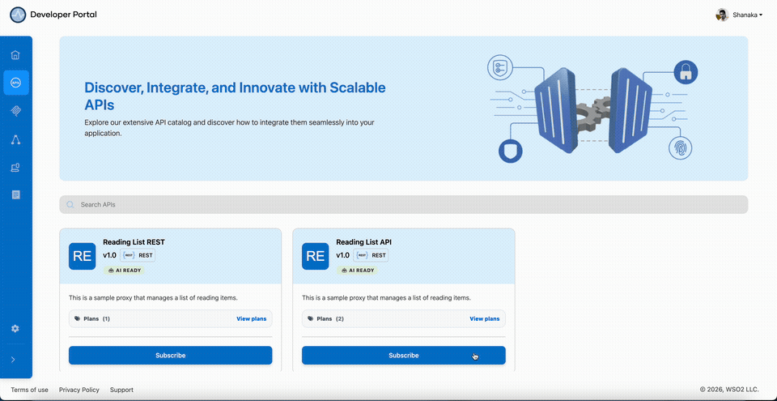
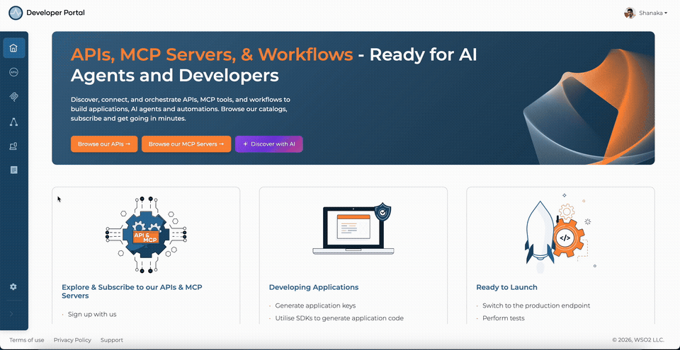
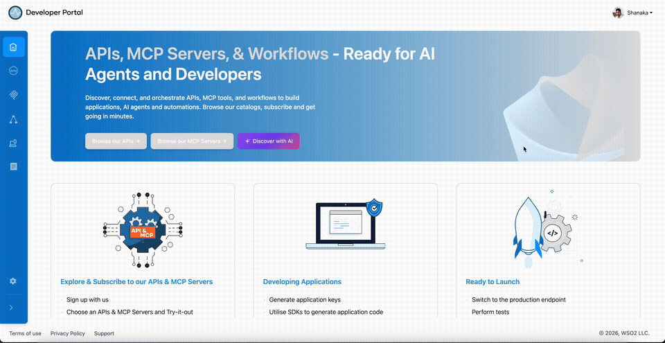

# Monetize a REST API with Stripe

## Overview

This guide shows you how to charge for an existing REST API without writing any billing code. WSO2 API Platform syncs usage to Stripe, handles payment processing, enforces subscription access, and gives consumers a self-service billing portal. By the end, you'll have a published Reading List API with a Pay-as-you-go plan and per-request Stripe metering on every authenticated call.

---

## Prerequisites

- A WSO2 API Platform account. Sign up for free at [console.bijira.dev](https://console.bijira.dev).
- A Stripe account with your **Publishable Key** and **Secret Key**. These are available in the Stripe Dashboard under **Developers > API Keys**.
- `curl` for testing.

---

## Architecture

```text
API consumers (developers / apps)

    |  HTTPS + OAuth2 bearer token
    v

+---------------------------+
|     WSO2 API Gateway      |
|  auth · rate limit · audit|
+---------------------------+

    |  HTTP                          |  usage records
    v                                v

Your backend API             +---------------------------+
                             |     Stripe                |
                             |  metering · invoicing     |
                             |  payment · portal         |
                             +---------------------------+
```

API consumers subscribe to a plan in the Developer Portal, pay via Stripe checkout, and call the API with an OAuth2 bearer token. The platform reports usage records to Stripe, which handles invoicing, payment collection, and the consumer billing portal — WSO2 API Platform never touches payment details.

---

## Step 1: Create an organization and project

Go to the [API Platform Console](https://console.bijira.dev) and sign in with your Google, GitHub, or Microsoft account.

If this is your first time signing in, you'll be prompted to create an organization. Enter `sampleorganization` as the name, accept the privacy policy and terms of use, and click **Create**.

Once you're on the organization home page, create a project:

1. Click **+ Create Project**.
2. Enter the following details:

    | Field | Value |
    |---|---|
    | **Display Name** | Sample Project |
    | **Identifier** | sample-project |
    | **Description** | My sample project |

3. Click **Create**.

**Expected result:** The project home page opens.

{.cInlineImage-full}

---

## Step 2: Create and deploy an API proxy

Create an API proxy from the Reading List OpenAPI spec. This is the endpoint the gateway protects and meters.

1. On the project home page, select **API Proxy**.
2. Click **Import API Contract**.
3. Click **URL for API Contract**, paste the following URL, and click **Next**:

    ```text
    https://raw.githubusercontent.com/wso2/bijira-samples/refs/heads/main/reading-list-api/openapi.yaml
    ```

4. On the **Create API Proxy** page, click **Create**.

**Expected result:** The API proxy is created with operations auto-generated from the Reading List API spec.

{.cInlineImage-full}

Then deploy the proxy to make it reachable:

1. In the left navigation menu, click **Deploy**.
2. Click **Deploy** in the **Development** card.
3. Click **Promote** to promote the proxy to Production. Select **Use Development endpoint configuration** and click **Next**.

**Expected result:** The **Production** card shows **Deployment Status** as **Active**.

{.cInlineImage-full}

---

## Step 3: Connect Stripe

Connect your Stripe account at the organization level. The platform uses these credentials to create Stripe products, prices, and usage records on your behalf — you don't write any billing code.

1. In the API Platform Console header, go to the **Organization** list and select your organization.
2. In the left navigation menu, click **Admin**, then click **Settings**.
3. Click the **Credentials** tab, then the **Stripe Credentials** sub-tab.
4. Click **Add Stripe Credentials**.
5. Enter your **Secret Key** and **Publishable Key** from the [Stripe Dashboard](https://dashboard.stripe.com/).
6. Click **Save**.

**Expected result:** Your Stripe account is connected and ready to process payments for API subscriptions.

{.cInlineImage-full}

!!! note
    You can use a Standard secret key or a Restricted secret key. For Restricted keys, see [Getting Started with API Monetization](../../cloud/api-monetization/getting-started.md) for the minimum permissions required.

---

## Step 4: Create subscription plans

Create a Pay-as-you-go subscription plan that charges consumers per API request.

1. In the left navigation menu, click **Admin**, then click **Settings**.
2. Click the **Subscription Plans** tab, then click **+ Create**.
3. Enter the following details:

    | Field | Value |
    |---|---|
    | **Name** | Pay-as-you-go |
    | **Description** | Pay $0.02 per API request, billed monthly |
    | **Request Count** | 1000 |
    | **Request Count Time Unit** | Minute |
    | **Pricing Model** | Unit |
    | **Currency** | USD |
    | **Billing Period** | Monthly |
    | **Unit Amount** | 0.02 |

4. Click **Create**.

**Expected result:** The Pay-as-you-go plan appears in the Subscription Plans list.

{.cInlineImage-full}

!!! note
    In usage-based models, a unit equals one API request. With the Unit model, the total charge is request count × unit price. For tiered pricing, use Volume or Graduated instead.

---

## Step 5: Enable the plan on the API

Enable the Pay-as-you-go plan on the Reading List API so consumers can discover and subscribe to it in the Developer Portal.

1. In the left navigation menu of your Reading List API proxy, click **Manage**, then click **Monetize**.
2. Enable the toggle for **Pay-as-you-go**.
3. Click **Save**.

**Expected result:** The Pay-as-you-go plan is active on the API and appears in the Developer Portal subscription dialog.

{.cInlineImage-full}

!!! tip
    You can enable multiple plans on the same API to offer tiered pricing — for example, a flat-rate tier alongside this pay-as-you-go tier — without managing separate APIs.

---

## Step 6: Publish the API to the Developer Portal

Publish the API so consumers can discover it, review available plans, and subscribe.

1. In the left navigation menu, click **Manage**, then click **Lifecycle**.
2. Click **Publish**.
3. In the **Publish API** dialog, confirm the details and click **Confirm**.

**Expected result:** The lifecycle state changes to **Published** and the API appears in the Developer Portal.

{.cInlineImage-full}

---

## Step 7: Subscribe to the paid plan

As an API consumer, subscribe to the Pay-as-you-go plan through the Developer Portal.

1. Go to [devportal.bijira.dev](https://devportal.bijira.dev) and sign in.
2. In the sidebar, click **APIs**.
3. Find the Reading List API and click **Subscribe**.
4. In the **Choose Your Subscription Plan** dialog, select an application from the dropdown, or create one named `Reading List App`.
5. Click **Subscribe** on the **Pay-as-you-go** plan.
6. A Stripe checkout window opens. Enter your payment details and complete the payment.

**Expected result:** The application is subscribed to the Reading List API under the Pay-as-you-go plan. The Stripe checkout confirmation is shown.

{.cInlineImage-full}

!!! note
    Payments are processed by Stripe, and WSO2 API Platform doesn't store your payment details. If your Stripe account is in test mode, use the test card `4242 4242 4242 4242` with any future expiry date and any CVC to complete checkout.

---

## Step 8: Generate API credentials

Generate OAuth2 credentials for your application so you can make authenticated API calls.

1. In the Developer Portal, click **Applications** and open **Reading List App**.
2. Click **Manage Keys**.
3. On the **Production** tab, click **Generate Key**.
4. Copy the **Consumer Key** and **Consumer Secret**.
5. Click **Generate** to generate an access token and copy it.

**Expected result:** You have an access token ready to use in API calls.

{.cInlineImage-full}

!!! note
    Bearer tokens expire after 3600 seconds by default. To extend the lifetime, click **Modify** on the Manage Keys page and increase the **Application Access Token Expiry Time** before generating.

---

## Step 9: Invoke the API

Make your first authenticated call to the monetized API using the access token.

```bash
curl -X GET https://<your-gateway-url>/reading-list/books \
  -H "Authorization: Bearer <your-token>"
```

Replace `<your-gateway-url>` with the API proxy URL from the API's **Overview** page in the Developer Portal and `<your-token>` with the access token you just copied.

**Expected result:** `HTTP 200` with a JSON list of books. Each successful call increments your usage meter in Stripe.

---

## Step 10: View billing and usage

After making API calls, check your usage, upcoming charges, and invoices from the Developer Portal.

1. In the Developer Portal, click your profile icon in the top right corner.
2. Click **Billing**.
3. On the **Usage Summary** tab, review your **Total Billed API Calls**, **Active Subscriptions**, and **Estimated Cost** for the current period.
4. Click the **Invoices** tab to view and download past invoices.
5. Click the **Billed Subscriptions** tab to see subscription details and click **Manage** to update or cancel.

**Expected result:** Your Reading List API calls appear in the usage breakdown with the Pay-as-you-go plan, and the estimated cost reflects your request count × $0.02.

{.cInlineImage-full}

!!! note
    Allow a few minutes for usage to appear in the Billing page after the first request.

---

## Verify

1. Confirm authenticated calls are billed. Call the API with your token and then check the Usage Summary — the call count should increment.

    **Expected result:** The request count in **Billing > Usage Summary** increases by the number of calls made.

2. Confirm unauthenticated requests are rejected. Call the API without an Authorization header.

    ```bash
    curl -v https://<your-gateway-url>/reading-list/books
    ```

    **Expected result:** `HTTP 401` Unauthorized.

3. Confirm subscription enforcement. In the Developer Portal, cancel the Pay-as-you-go subscription under **Billing > Billed Subscriptions > Manage > Cancel**. Then attempt to call the API with the same token.

    **Expected result:** `HTTP 403` Forbidden — the gateway revokes access when the subscription lapses.

---

## Troubleshooting

| Symptom | Resolution |
|---|---|
| Stripe Credentials save fails | Confirm your Secret Key and Publishable Key are from the same Stripe account and that the secret key has the required permissions. |
| Plans don't appear in Developer Portal subscription dialog | Confirm the plan toggles are enabled in **Manage > Monetize** and the API is in the **Published** lifecycle state. |
| Stripe checkout doesn't open | Confirm your Stripe account is active and not in restricted mode. Check the Stripe Dashboard for any pending account verification. |
| `HTTP 401` on every call after subscribing | Confirm your access token is not expired. Generate a new token in **Manage Keys** and update your request. |
| `HTTP 403` after subscribing | Confirm the subscription is active in **Billing > Billed Subscriptions**. If payment failed, the subscription may be inactive. |
| Usage not appearing in Billing page | Allow a few minutes after making calls. Usage reporting to Stripe is near-real-time but not instantaneous. |
| Cannot cancel subscription | Subscription cancellation is available in the Developer Portal under **Billing > Billed Subscriptions > Manage**. Only the consumer who created the subscription can cancel it. |

---

## What you learned

- Connected a Stripe account to WSO2 API Platform so the platform manages all billing infrastructure without custom code.
- Created a Unit-priced Pay-as-you-go subscription plan, then enabled and published it to the Developer Portal for consumer self-service.
- Subscribed to a paid plan via a Stripe-powered checkout, with access granted immediately after payment.
- Invoked a monetized API using OAuth2 credentials, with each request automatically metered and reported to Stripe.
- Viewed real-time usage, invoices, and subscription management from the Developer Portal Billing page.

---

## Next steps

- [Attach and manage policies](../../cloud/develop-api-proxy/policy/attach-and-manage-policies.md) — pair your subscription plans with rate limiting and other policies to protect your backend from overuse.
- [Manage paid subscription plans](../../cloud/api-monetization/manage-paid-subscription-plans.md) — edit, version, or deactivate your plans as your pricing evolves.
- [Insights](../../cloud/monitoring-and-insights/insights.md) — track request volume, error rates, and latency per plan in the API Platform Console.