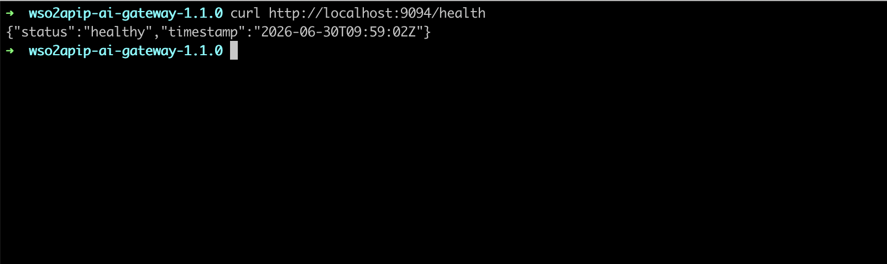
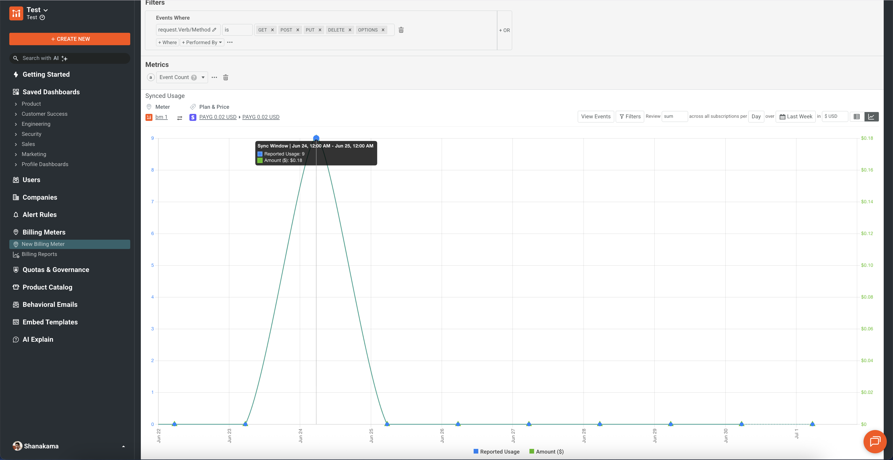

# Monetize MCP Tools with the Self-Hosted Gateway

## Overview

This guide shows you how to monetize Model Context Protocol (MCP) tools exposed through the WSO2 API Platform self-hosted gateway. Instead of charging for raw REST endpoints, you charge AI agents and applications for the MCP tool calls they make. The gateway authenticates every tool call, captures it as an analytics event, and publishes it to Moesif, where you define usage-based billing meters and connect a billing provider such as Stripe to invoice consumers automatically.

By the end, you'll have a self-hosted AI gateway fronting an MCP server, MCP tool traffic flowing through it, and per-tool-call usage published to Moesif and ready to bill.

!!! note "Self-hosted gateway only"
    MCP tool monetization is **not available on the cloud gateway**. It requires the self-hosted AI gateway because monetization depends on the gateway's analytics publisher and a Moesif integration that you configure manually in the gateway `config.toml`. The cloud gateway currently supports [API monetization with Stripe](api-monetization.md) for REST APIs only.

---

## Key Concepts

Before you start, here are the terms this guide uses:

**Self-hosted AI gateway** is the WSO2 API Platform AI Gateway distribution you run in your own environment with Docker Compose. It hosts MCP proxies and enforces authentication, rate limiting, and analytics.

**MCP proxy** is the gateway resource that fronts a backend MCP server. It exposes the backend's tools, resources, and prompts to MCP clients under a single governed endpoint.

**MCP tool** is a single callable operation an MCP client invokes through the proxy (for example, a `tools/call` request). This is the unit you meter and charge for.

**Analytics publisher** is the gateway component that asynchronously captures each request as an analytics event and publishes it to an external analytics platform. Today the supported publisher is Moesif.

**Moesif** is the analytics and monetization platform WSO2 API Platform integrates with. It receives tool-call events, applies usage-based billing meters, and connects to a billing provider.

**Billing provider** is the payment platform (such as Stripe, Recurly, or Chargebee) that Moesif connects to for invoicing and payment collection.

---

## Prerequisites

- A Docker-compatible container runtime (Docker Desktop, Rancher Desktop, Colima, or Docker Engine with the Compose plugin). Confirm that `docker` and `docker compose` are available:

    ```bash
    docker --version
    docker compose version
    ```

- A Moesif account and a Collector **Application ID**. Sign up at [moesif.com](https://www.moesif.com/), follow the onboarding wizard, and copy the Application ID it generates.
- A billing provider account (this guide uses Stripe) with access to the [Stripe Dashboard](https://dashboard.stripe.com/) for connecting it to Moesif.
- A backend MCP server to expose. This guide uses the public `mcp-everything` sample.
- `curl` for deploying the proxy and generating traffic.

---

## Architecture

```text
MCP client (AI agent / app)

    |  HTTPS + OAuth2 bearer token (per tool call)
    v

+-----------------------------------+
|      WSO2 self-hosted AI Gateway   |
|  MCP auth · routing · analytics    |
+-----------------------------------+

    |  MCP traffic                    |  analytics events (async)
    v                                 v

Backend MCP server            +---------------------------+
(tools / resources)           |          Moesif           |
                              |  usage meters · billing   |
                              +-------------+-------------+
                                            |
                                            v
                              +---------------------------+
                              |   Billing provider        |
                              |   (Stripe) invoicing      |
                              +---------------------------+
```

An MCP client calls a tool through the gateway with an OAuth2 bearer token. The gateway validates the token, routes the call to the backend MCP server, and asynchronously publishes a usage event to Moesif. Moesif counts each tool call against a billing meter and connects to Stripe for invoicing — the gateway never touches payment details, and analytics collection never adds latency to the tool call.

---

## Step 1: Start the self-hosted AI gateway

Download and start the AI gateway distribution with Docker Compose.

```bash
# Download the distribution.
wget https://github.com/wso2/api-platform/releases/download/ai-gateway/v1.1.0/wso2apip-ai-gateway-1.1.0.zip

# Unzip the downloaded distribution.
unzip wso2apip-ai-gateway-1.1.0.zip

# Start the complete stack.
cd wso2apip-ai-gateway-1.1.0/
docker compose -p ai-gateway up -d

# Verify the gateway controller admin endpoint is running.
curl http://localhost:9094/health
```

**Expected result:** The health endpoint returns a success response, confirming the gateway is up.

{.cInlineImage-full}


!!! tip
    Keep the distribution directory open in a terminal. You'll edit `config.toml` inside it in Step 3 and restart the stack to apply the analytics configuration.

---

## Step 2: Deploy an MCP proxy with authentication

Start the sample MCP server, then deploy an MCP proxy that fronts it and requires an OAuth2 token on every tool call. Securing the proxy is what lets you attribute each tool call to a consumer for billing.

1. Start the sample MCP server on the gateway network:

    ```bash
    docker run -p 3001:3001 --name everything --network ai-gateway_gateway-network rakhitharr/mcp-everything:v3
    ```

2. Deploy the MCP proxy with the `mcp-auth` policy applied. Replace the `issuers` and `jwks` values with your own identity provider details (see [MCP Authentication](../../ai-gateway/1.1.0/mcp-proxy/policies/mcp-authentication.md) for the matching `config.toml` key manager setup):

    ```bash
    curl -X POST http://localhost:9090/api/management/v0.9/mcp-proxies \
      -H "Content-Type: application/yaml" \
      -H "Authorization: Basic YWRtaW46YWRtaW4=" \
      --data-binary @- <<'EOF'
    apiVersion: gateway.api-platform.wso2.com/v1alpha1
    kind: Mcp
    metadata:
      name: everything-mcp-v1.0
    spec:
      displayName: Everything
      version: v1.0
      context: /everything
      specVersion: "2025-06-18"
      upstream:
        url: http://everything:3001
      policies:
        - name: mcp-auth
          version: v0.1.1
          params:
            issuers:
              - PrimaryIDP
      tools: []
      resources: []
      prompts: []
    EOF
    ```

**Expected result:** The gateway returns `HTTP 201` and the proxy reaches the `deployed` state. The MCP server is reachable at `http://localhost:8080/everything/mcp` and rejects unauthenticated tool calls.

!!! note
    The `mcp-auth` policy makes each consumer present a JWT access token. The token's claims (such as the subject or a client ID) identify the consumer in the analytics events, which is how Moesif attributes usage and bills the right account. Without authentication, all tool calls would be anonymous and could not be billed per consumer.

---

## Step 3: Enable analytics and configure the Moesif publisher

Analytics is configured entirely in the gateway `config.toml` and enabled at the system level. This is the step that turns raw tool traffic into billable usage data.

1. Open `gateway/configs/config.toml` in the gateway distribution.
2. Add the analytics configuration, replacing `<MOESIF_APPLICATION_ID>` with your Moesif Collector Application ID:

    ```toml
    [analytics]
    enabled = true

    [[analytics.publishers]]
    type = "moesif"
    enabled = true

    [analytics.publishers.settings]
    application_id = "<MOESIF_APPLICATION_ID>"
    publish_interval = 5
    event_queue_size = 10000
    batch_size = 50
    timer_wakeup_seconds = 3

    [analytics.grpc_event_server]
    buffer_flush_interval = 1000000000
    buffer_size_bytes = 16384
    grpc_request_timeout = 20000000000
    server_port = 18090
    shutdown_timeout = 600
    als_plain_text = true
    max_message_size = 1000000000
    max_header_limit = 8192
    ```

3. Save the file.

**Expected result:** The gateway is configured to publish every MCP tool call as an analytics event to your Moesif application.

!!! note
    Analytics events are collected asynchronously and batched before publishing, so enabling analytics does not add latency to tool calls. For the full list of publisher and gRPC event server parameters, see [Configure Moesif Analytics](../../api-gateway/1.1.0/analytics/moesif-analytics.md).

---

## Step 4: Apply the analytics restart and confirm publishing

Restart the gateway so it picks up the analytics configuration.

```bash
docker compose -p ai-gateway up -d
```

**Expected result:** The gateway restarts with analytics enabled. The policy-engine logs show the ALS server listening on the configured `server_port` (18090).

!!! tip "Protect sensitive headers"
    Before sending production traffic to Moesif, attach the [Analytics Header Filter](../../api-gateway/1.1.0/analytics/analytics-header-filter.md) policy to the MCP proxy to strip authentication tokens and other sensitive headers from the published events. Use `deny` mode to exclude headers such as `Authorization`.

---

## Step 5: Generate MCP tool traffic

Connect an MCP client to the proxy and call a tool so that Moesif receives usage events.

1. Add the following server URL to your MCP client (for example, an MCP-capable AI assistant) and supply a valid bearer token issued by your identity provider:

    ```text
    http://localhost:8080/everything/mcp
    ```

2. Invoke one or more tools exposed by the Everything sample server.

**Expected result:** Each tool call returns a successful MCP response. Within a few seconds, the calls appear as events in your Moesif dashboard under **Live Event Log**.

!!! note
    Allow a few seconds for events to surface in Moesif. The `publish_interval` (5 seconds in Step 3) controls how frequently the gateway flushes batched events to Moesif.

---

## Step 6: Create a usage-based billing meter in Moesif

In Moesif, define a billing meter that counts MCP tool calls. This is where you decide what to charge for and how much.

1. In the Moesif dashboard, go to **Billing Meters** and create a new meter.
2. Set the meter to count API calls, and filter the events to your MCP proxy traffic — for example, by request URI prefix `/everything` or by the tool-call method.
3. Choose a pricing model (for example, a per-call unit price or tiered/volume pricing) and a billing period.
4. Save the meter.

**Expected result:** The meter aggregates incoming MCP tool-call events into a billable quantity per consumer.

{.cInlineImage-full}


!!! note
    Because the gateway publishes the consumer identity (from the validated JWT) and the request path with each event, you can meter per tool, per consumer, or per plan. See the [Moesif metered billing documentation](https://www.moesif.com/docs/metered-billing/) for meter configuration details.

---

## Step 7: Connect Stripe as the billing provider

Connect Moesif to Stripe so metered usage is converted into invoices and payments automatically.

1. In the Moesif dashboard, open **Settings > Extensions** (or **Billing Provider**) and select **Stripe**.
2. Authorize Moesif to access your Stripe account, or enter your Stripe API key.
3. Map your Moesif billing meter to a Stripe product and price.
4. Save the integration.

**Expected result:** Moesif reports metered MCP tool usage to Stripe, which issues invoices and collects payment from subscribed consumers. WSO2 API Platform never stores payment details.

!!! note
    Moesif also integrates with Recurly, Chargebee, and Zuora. The same metered usage data drives billing regardless of the provider you choose. See the [Analytics and Monetization overview](../../analytics-and-monetization/overview.md) for the full list of capabilities.

---

## Verify

1. Confirm tool calls are captured. Make an authenticated tool call through the gateway, then open the Moesif **Live Event Log**.

    **Expected result:** The tool call appears as an event with the consumer identity and the `/everything` request path.

2. Confirm unauthenticated calls are rejected. Call a tool without a bearer token.

    **Expected result:** The gateway returns `HTTP 401` Unauthorized, and no billable event is recorded.

3. Confirm usage drives billing. Make several tool calls, then open the billing meter in Moesif.

    **Expected result:** The meter quantity increases by the number of tool calls, and the projected charge reflects your configured price.

---

## Troubleshooting

| Symptom | Resolution |
|---|---|
| Health check fails after `docker compose up` | Confirm the ports `8080`, `9090`, and `9094` are free and that all containers in the `ai-gateway` project are running with `docker compose -p ai-gateway ps`. |
| MCP proxy deploy returns `409 Conflict` | An MCP proxy with the same name and version already exists. Use a new `metadata.name`/`version` or delete the existing proxy. |
| Tool calls return `HTTP 401` even with a token | Confirm the `mcp-auth` `issuers` reference a key manager defined under `policy_configurations.jwtauth_v0.keymanagers` in `config.toml`, and that the token is signed by that issuer. |
| No events appear in Moesif | Confirm `analytics.enabled = true`, the `application_id` matches your Moesif Collector ID, and the gateway was restarted after editing `config.toml`. |
| Events appear in Moesif but the meter stays at zero | Confirm the billing meter's filter matches the MCP proxy traffic (request URI prefix or tool method) and the billing period is active. |
| Sensitive headers visible in Moesif events | Attach the Analytics Header Filter policy in `deny` mode to the MCP proxy to exclude `Authorization` and other sensitive headers. |
| Stripe invoices not generated | Confirm the Stripe integration is authorized in Moesif and the billing meter is mapped to a Stripe product and price. |

---

## What you learned

- Ran the WSO2 self-hosted AI gateway and deployed an authenticated MCP proxy in front of a backend MCP server.
- Enabled the gateway analytics publisher and configured Moesif to receive every MCP tool call as a usage event, without adding latency.
- Created a usage-based billing meter in Moesif that counts MCP tool calls per consumer.
- Connected Stripe as the billing provider so metered tool usage is invoiced and collected automatically.

---

## Next steps

- [MCP Authentication](../../ai-gateway/1.1.0/mcp-proxy/policies/mcp-authentication.md) — configure key managers, scopes, and audiences to control which consumers can call your tools.
- [Configure Moesif Analytics](../../api-gateway/1.1.0/analytics/moesif-analytics.md) — tune publish intervals, batching, and the gRPC event server for production traffic.
- [Analytics and Monetization with Moesif](../../analytics-and-monetization/overview.md) — explore quotas, prepaid credits, behavioral alerts, and embedded metrics.
- [Monetize a REST API with Stripe](api-monetization.md) — compare the cloud gateway monetization flow for REST APIs.
