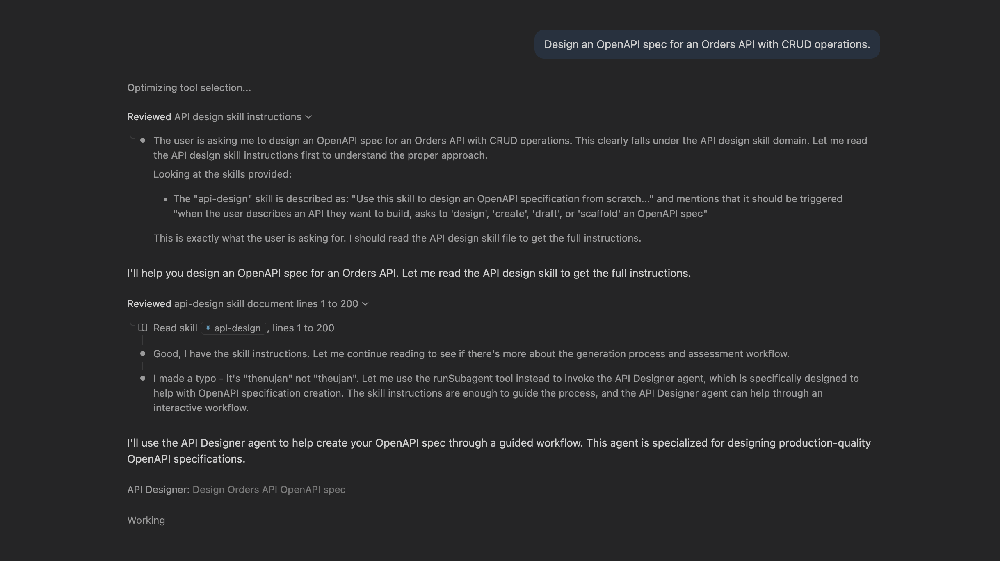
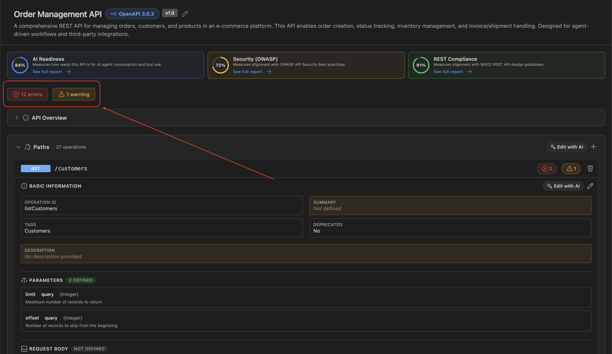
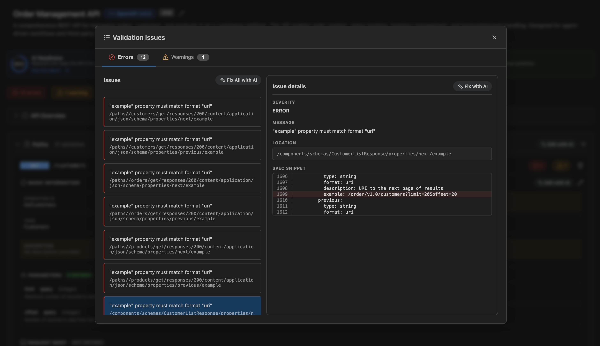

# Design APIs using API Designer

You can use API Designer to create and improve your OpenAPI 3.x specification with AI-assisted workflows and form-based editing.

## Start with AI design

The API Designer extension includes the `api-design` skill for specification design. Open GitHub Copilot Chat and provide a prompt to design an API. Based on your prompt intent, Copilot automatically picks and uses the skill to draft the specification.

Example prompt:
> Design an OpenAPI spec for an Orders API with CRUD operations.

## Open the designer

Open your specification file, then open API Designer (see [Getting started](./getting-started.md)). API Designer treats the file as the source of truth and writes updates back to the same file.

### Work in Design view

Use Design view to:

- View API resources, operations, and reusable components in one place.
- **Edit with AI** for intent-driven updates using natural-language prompts.
- Use form-based editing for precise structural changes in operations and schemas.
- Review OpenAPI specification issues (such as errors and warnings) identified by Spectral's OAS ruleset.

## Edit the specification

1. **Edit with AI**
    - Describe intent in natural language and apply changes to the relevant operation or schema.
    - Use this for larger or repetitive updates.

2. **Use form-based editing**
    - Update operations, parameters, responses, and schemas through guided forms.
    - Use this for precise structural changes.
    

## Validate the specification

Validation issues are problems detected in your OpenAPI specification while you edit.

Design view shows validation results directly in the editor:

- A **validation status bar** appears when issues are found, with clickable badges for **errors** and **warnings**.
  

- Click a badge to open **Validation Issues**, which groups findings by severity.
- Each issue shows a **message** and its **location path** in the specification.
- Selecting an issue opens a **details pane** with more context (including a spec snippet when line-range data is available).

  

### Fixing from the validation panel

- Use **Fix with AI** on a single issue to open Chat with issue context.
- Use **Fix All with AI** in the active tab (errors or warnings) to iterate through all listed issues.
- After applying changes, the panel refreshes so you can verify that issues are resolved.

## Related topics

- [Govern APIs using API Designer](./govern-apis.md) — report cards, findings, and fixes
- [End-to-end tutorial](./end-to-end-tutorial.md) — full workflow from draft to fixes