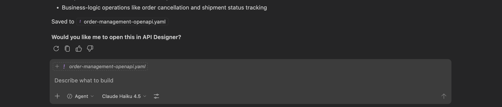
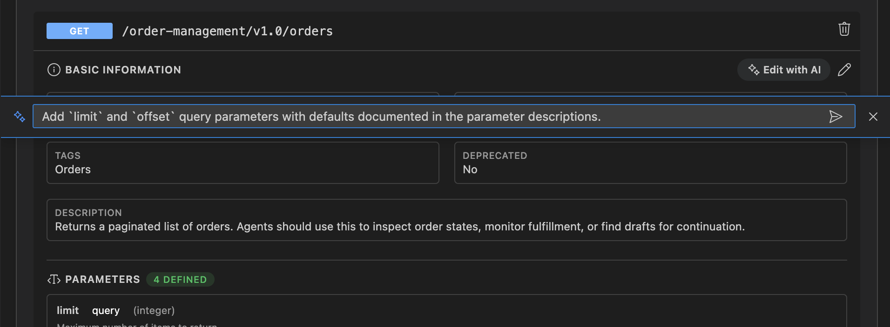
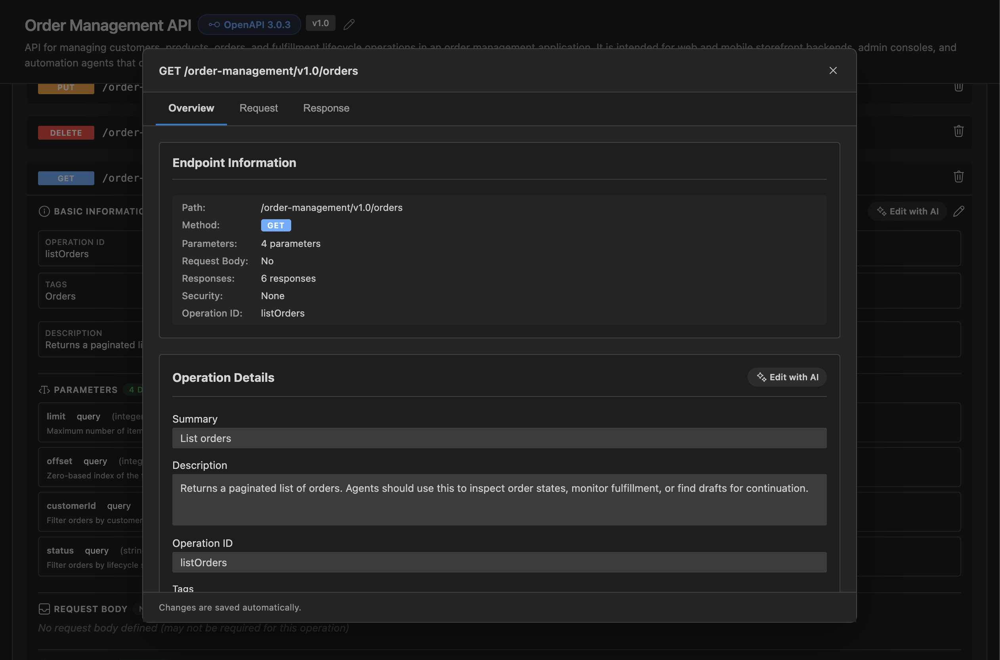
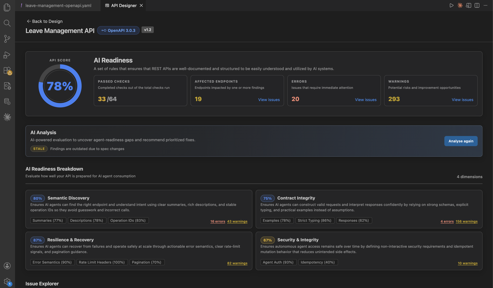

# End-to-end tutorial

Follow this guide once to understand the full API Designer workflow using one OpenAPI file.

In this tutorial, you will:

- Draft a spec with Copilot.
- Refine it in API Designer.
- Review governance reports.
- Fix findings using Chat.

## Step 1: Draft the spec with Copilot

1. Open GitHub Copilot Chat with agent mode.
2. Ask Copilot to scaffold a complete OpenAPI specification for an Orders API.

Example prompt:

> Design an API for Order management app

3. Copilot Chat uses the `api-design` skill, may ask clarifying questions, and iterates until the specification is ready. It then writes and saves the file.

Outcome: A working OpenAPI draft on workspace.

Note: If Copilot prompts you to open the specification in API Designer, confirm the prompt.

## Step 2: Open API Designer

1. With the openapi spec file (e.g: `orders-api.yaml`) focused, open API Designer using one of these options:
    - Copilot Chat: Confirm the prompt to open in API Designer (uses the `openInApiDesigner` tool).
      
    - CodeLens: Open in API Designer.
    - Title bar: Open in API Designer.
    - Command Palette: API Designer: Open in API Designer.
    - If a notification appears (“Open it in API Designer?”), choose **Open in API Designer**.

Outcome: You get a structured view of paths, operations, and components.

## Step 3: Edit with AI

1. Stay in the designer (or use the AI entry point your build provides for "edit with AI").
2. Prompt with scope, for example:

   Click on the **Edit with AI** button in the orders GET endpoint and type:

      > Add `limit` and `offset` query parameters with defaults documented in the parameter descriptions.

      

   This will open up the copilot chat in agent mode and run the prompt with the provided scope.

3. Review the proposed changes and accept only what matches your API conventions.

Outcome: Fast updates for larger or repetitive changes.

## Step 4: Use form-based edits

1. In the designer, open the Edit form for a specific operation or schema.
2. Adjust a response code, update an operation summary/description, mark a schema field as required, or refine a parameter type and constraints.

   

Outcome: Safe and precise structural edits.

## Step 5: Open a governance report and review findings

1. In the designer, report cards are available for the following:
   - WSO2 REST API AI Readiness Guidelines
   - WSO2 REST API Design Guidelines
   - OWASP API Security Top 10
2. Click any report card to open the full report and review its score and issue list.



Outcome: You can prioritize issues by impact and severity.

## Step 6: Triage findings

1. Quick wins: missing `operationId`, obvious response gaps, and thin descriptions.
2. Design consistency: naming, pagination envelope, and error model alignment.
3. Security: items that need real auth configuration or URLs.

Outcome: A practical fix backlog.

## Step 7: Fix with AI (Chat + `api-design` skill)

1. Open **Chat** with the spec available (open editor or `@` file reference, depending on product).
2. Ask for a bounded fix tied to the report, for example:

   > Using the api-design skill: apply all **auto-fixable** findings from the current readiness report for `orders-api.yaml`. Do **not** rename paths without asking. List anything that needs manual security or deployment details.

3. Open the relevant report card again and review the updated report.

Outcome: Better report scores and fewer open findings.

## Recap

```text
Copilot (draft YAML)
Open in API Designer -> structured editor (overview)
Edit with AI (scoped) + Forms (precise)
Report cards (ready in UI) -> Spectral reports + AI readiness narrative
Chat / api-design skill -> safe fixes + confirm breaking changes
Open reports again -> ship or iterate
```

## See also

- [API Designer getting started](./getting-started.md)
- [Design APIs with API Designer](./design-apis.md)
- [Govern APIs with API Designer](./govern-apis.md)