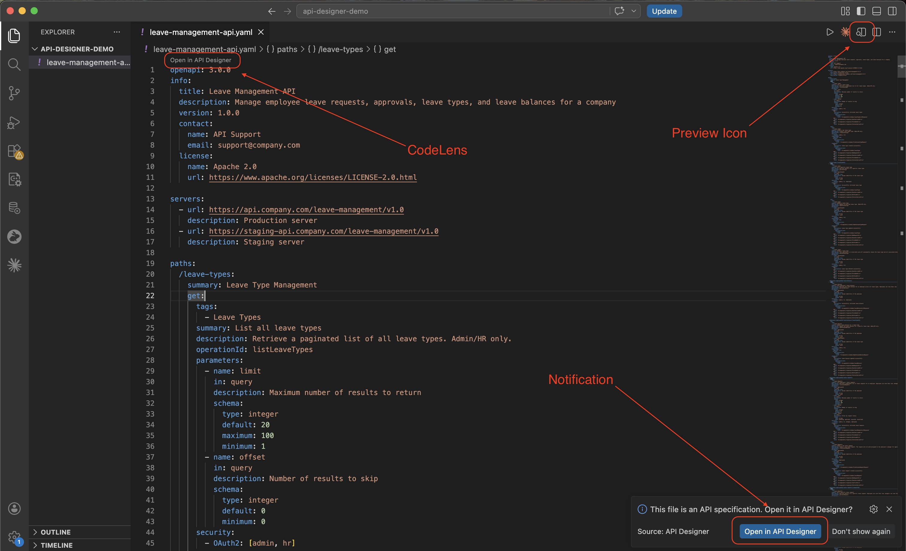

# API Designer

API Designer is a Visual Studio Code extension for building and improving OpenAPI specifications. It helps you use AI to design APIs faster, assess AI readiness, and fix governance issues.

## What you can do

- Design APIs with **Github Copilot** using the built-in **API Design Skill**, with guided recommendations and faster fixes.
- Design and edit OpenAPI specs visually inside VS Code with GitHub Copilot Assistance
- Validate APIs against governance and best-practice rulesets
- Analyze **AI readiness** and identify improvement areas

## Prerequisites

- Visual Studio Code (compatible with extension engine requirement `^1.100.0`).
- GitHub Copilot (optional, recommended for AI-assisted workflows).

## Quick start

1. Install API Designer from the [VS Code Marketplace](https://marketplace.visualstudio.com/items?itemName=WSO2.api-designer).
2. Open your OpenAPI file (`.yaml` or `.json`), or create one with GitHub Copilot using the bundled `api-design` skill.
3. Open API Designer. You can open it in any of these ways:

    - CodeLens in the file: Open in API Designer
    - Editor title bar: Open in API Designer
    - Command Palette (`Ctrl+Shift+P` / `Cmd+Shift+P`): API Designer: Open in API Designer
    - Open-file notification (when `apiDesigner.notifyOnOpen` is enabled)

    

4. Use AI-assisted editing to improve operations, descriptions, and examples in your spec.
   

5. Open report cards and review AI readiness and governance findings.
   

## Next steps

- Learn how to create and refine your specification in [Design APIs using API Designer](./design-apis.md).
- Learn how report cards, rulesets, and issue triage work in [Govern APIs using API Designer](./govern-apis.md).
- Follow the complete workflow in [End-to-end tutorial](./end-to-end-tutorial.md).